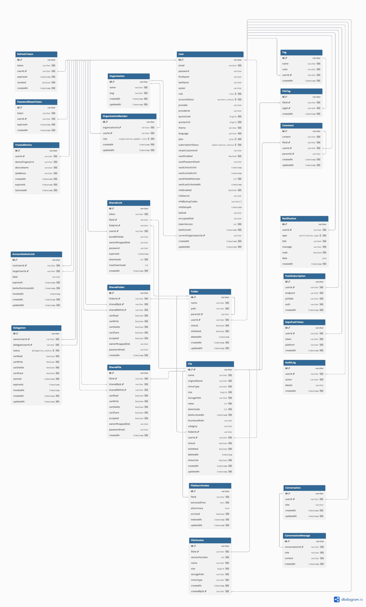

#  Backend — Documentation Technique

API REST Express / TypeScript du projet **SUPFile**.  
Port par défaut : **5001**. Swagger UI disponible sur `/api-docs`.

---

## Stack technique

| Composant | Technologie |
|---|---|
| Runtime | Node.js 20 |
| Framework | Express + TypeScript |
| ORM | Prisma (PostgreSQL 16) |
| Auth | JWT (Bearer) + Passport.js (OAuth2 Google/GitHub) |
| Upload | Multer (multipart) |
| WebSockets | Socket.io |
| Chiffrement | AES-256-GCM (KekService & EncryptionService) |
| Architecture | KEK / DEK (Key Encryption Key / Data Encryption Key) |
| Dérivation | PBKDF2-SHA512 (100 000 itérations) |
| Docs | Swagger / OpenAPI (`/api-docs`) |

---

## Modele de donnees (MCD)



---

## Structure des dossiers

```
backend/
 src/                  # Code source TypeScript
    config/           # Configuration transversale
    controllers/      # Couche HTTP — gère req/res, délègue aux services
    middlewares/      # Middlewares Express
    routes/           # Définition des routes
    services/         # Logique métier
    types/            # Types TypeScript partagés
    utils/            # Utilitaires (cors, helpers)
    index.ts          # Point d'entrée App
 entrypoint.sh         # Script de démarrage Docker (migrations + app)
 Dockerfile            # Image de production
 prisma/               # Schéma et migrations database
```

---

## Sécurité globale (index.ts)

| Mécanisme | Détail |
|---|---|
| Helmet | Headers de sécurité (CSP désactivé pour les previews, HSTS configurable) |
| CORS | Origines autorisées via `ALLOWED_ORIGINS` (env) |
| Rate limit général | 500 req/min sur `/api/` |
| Rate limit auth | 10 req/15min sur `/api/auth/login` et `/api/auth/register` |
| HTTPS redirect | Activé si `ENFORCE_HTTPS=true` |
| Body limit | 5 GB (pour les gros uploads) |

---

## Middlewares

| Fichier | Rôle |
|---|---|
| `auth.ts` | `authenticate` — vérifie le JWT Bearer et attache `req.user` + `req.authContext` |
| `delegation.ts` | `requireDelegationPermission(perm)` — vérifie les droits en session déléguée (read / write / delete / share) |
| `permissions.ts` | `requireFolderPermission(perm)` — vérifie les droits sur un dossier partagé |
| `quotaCheck.ts` | `checkQuotaBeforeUpload` — bloque l'upload si quota dépassé |
| `admin.ts` | `requireAdmin` — vérifie que l'utilisateur est administrateur |
| `activityMiddleware.ts` | Met à jour `lastActivity` de la session à chaque requête |
| `errorHandler.ts` | Handler d'erreurs centralisé — gère `AppError` et erreurs inattendues |
| `validation.ts` | Wrapper `express-validator` — déclenche les erreurs de validation |

---

## Normalisation des Réponses (`utils/response.ts`)

Toutes les réponses de l'API sont normalisées via des helpers pour garantir une structure cohérente et faciliter l'intégration côté frontend.

### Structure standard
- **Succès** : `{ success: true, data? }`
- **Erreur** : `{ success: false, error: string, code?: string }`

### Helpers disponibles
| Fonction | Usage | Status par défaut |
|---|---|---|
| `sendSuccess(res, data?, status?)` | Retourne un succès avec données optionnelles | 200 |
| `sendCreated(res, data?)` | Retourne un succès 201 (utile après POST) | 201 |
| `sendError(res, error, status, code?)` | Retourne une erreur avec message et code optionnel | (requis) |

Exemple d'usage :
```typescript
import { sendSuccess, sendError } from '../utils/response';

// Succès
return sendSuccess(res, { user });

// Erreur avec code spécifique
return sendError(res, "Compte bloqué", 401, 'ACCOUNT_DISABLED');
```

---

## Routes & Endpoints

### `/api/auth` — Authentification

| Méthode | Route | Auth | Description |
|---|---|---|---|
| POST | `/register` |  | Inscription (email + password, validé) |
| POST | `/login` |  | Connexion locale |
| POST | `/logout-all` |  | Révoque tous les refresh tokens |
| GET | `/profile` |  | Infos utilisateur courant |
| PUT | `/profile` |  | Mise à jour du profil |
| POST | `/avatar` |  | Upload avatar (multipart) |
| POST | `/change-password` |  | Changement de mot de passe |
| GET | `/export-data` |  | Export RGPD des données utilisateur |
| GET | `/google` |  | Redirection OAuth2 Google |
| GET | `/google/callback` |  | Callback Google  JWT |
| GET | `/github` |  | Redirection OAuth2 GitHub |
| GET | `/github/callback` |  | Callback GitHub  JWT |

---

### `/api/files` — Gestion des fichiers

| Méthode | Route | Permission | Description |
|---|---|---|---|
| POST | `/upload` | write | Upload (multipart, jusqu'à 100 fichiers) avec vérification quota |
| GET | `/` | read | Liste les fichiers d'un dossier (`?folderId=`) |
| GET | `/search` | read | Recherche par nom / extension / date / type |
| GET | `/deleted` | read | Fichiers en corbeille |
| GET | `/favorites` | read | Fichiers favoris |
| GET | `/shares/accepted` | read | Fichiers partagés acceptés |
| GET | `/export/csv` | read | Export CSV de la liste de fichiers |
| GET | `/:fileId` | read | Détails d'un fichier |
| GET | `/:fileId/download` | read | Téléchargement (déchiffrement AES-256) |
| GET | `/:fileId/stream` | read | Streaming (Range headers pour audio/vidéo) |
| PUT | `/:fileId` | write | Renommage |
| PUT | `/:fileId/move` | write | Déplacement dans un autre dossier |
| POST | `/:fileId/restore` | write | Restauration depuis la corbeille |
| POST | `/:fileId/favorite` | write | Toggle favori |
| DELETE | `/:fileId` | delete | Soft delete (corbeille) |

---

### `/api/folders` — Gestion des dossiers

| Méthode | Route | Permission | Description |
|---|---|---|---|
| POST | `/` | write | Créer un dossier |
| GET | `/` | read | Lister les dossiers (`?folderId=` pour sous-dossiers) |
| GET | `/deleted` | read | Dossiers en corbeille |
| GET | `/:folderId` | read | Détails d'un dossier |
| GET | `/:folderId/breadcrumbs` | read | Fil d'Ariane |
| GET | `/:folderId/download` | read | Télécharger en ZIP (streaming AES-256 à la volée) |
| GET | `/:folderId/trash-contents` | read | Contenu corbeille du dossier |
| POST | `/:folderId/restore` | write | Restaurer |
| PUT | `/:folderId` | write | Renommer |
| PUT | `/:folderId/move` | write | Déplacer |
| DELETE | `/:folderId` | delete | Supprimer (soft delete) |

---

### `/api/share` — Partage

#### Liens publics (non-authentifiés)
| Méthode | Route | Auth | Description |
|---|---|---|---|
| GET | `/:token` |  | Accès à un fichier / dossier partagé publiquement |
| GET | `/:token/download` |  | Télécharger via lien public |

#### Gestion des liens
| Méthode | Route | Permission | Description |
|---|---|---|---|
| POST | `/links` | share | Créer un lien public (optionnel : password, expiration, maxDownloads) |
| GET | `/links` | read | Lister mes liens publics |
| DELETE | `/links/:linkId` | delete | Supprimer un lien |

#### Partage interne — Dossiers
| Méthode | Route | Permission | Description |
|---|---|---|---|
| POST | `/folders` | share | Partager un dossier avec un utilisateur |
| GET | `/folders/with-me` | read | Dossiers partagés avec moi |
| GET | `/folders/by-me` | read | Dossiers que j'ai partagés |
| PATCH | `/folders/:shareId/permissions` | share | Modifier les permissions |
| DELETE | `/folders/:shareId` | delete | Révoquer le partage |
| POST | `/folders/:shareId/accept` | write | Accepter un partage |
| POST | `/folders/:shareId/reject` | write | Refuser un partage |

#### Partage interne — Fichiers
| Méthode | Route | Permission | Description |
|---|---|---|---|
| POST | `/files` | share | Partager un fichier avec un utilisateur |
| GET | `/files/with-me` | read | Fichiers partagés avec moi |
| GET | `/files/by-me` | read | Fichiers que j'ai partagés |
| GET | `/files/:fileId/shares` | read | Voir les partages d'un fichier |
| PATCH | `/files/:shareId/permissions` | share | Modifier les permissions |
| DELETE | `/files/:shareId` | delete | Révoquer |
| POST | `/files/:shareId/accept` | write | Accepter |
| POST | `/files/:shareId/reject` | write | Refuser |
| GET | `/access/:fileId/stream` | read | Streamer un fichier partagé avec moi |
| GET | `/access/:fileId/download` | read | Télécharger un fichier partagé avec moi |

#### Divers
| Méthode | Route | Description |
|---|---|---|
| GET | `/pending` | Partages en attente (acceptation / rejet) |

---

### `/api/mfa` — Multi-Factor Authentication (TOTP)

| Méthode | Route | Auth | Description |
|---|---|---|---|
| POST | `/setup` |  | Génère le secret TOTP + QR code |
| POST | `/verify-setup` |  | Valide le premier code  active le MFA |
| POST | `/verify` |  (tempToken) | Vérifie un code TOTP lors du login |
| POST | `/verify-backup-code` |  (tempToken) | Vérifie un code de secours |
| POST | `/regenerate-codes` |  | Régénère les codes de secours |
| GET | `/trusted-devices` |  | Liste des appareils de confiance |
| DELETE | `/trusted-devices/:deviceId` |  | Révoquer un appareil |
| POST | `/disable` |  | Désactiver le MFA |
| GET | `/status` |  | Statut MFA de l'utilisateur |

---

### `/api/ai` — Assistant Bobby (RAG)

| Méthode | Route | Permission | Description |
|---|---|---|---|
| POST | `/chat` | read | Chat RAG avec Bobby (utilise brain-api) |
| POST | `/analyze-file` | read | Analyser le contenu d'un fichier spécifique |
| POST | `/search-files` | read | Recherche sémantique dans les documents |
| POST | `/generate-file` | write | Créer un fichier texte généré par IA |
| POST | `/reindex` | write | Re-indexer les fichiers dans ChromaDB |
| GET | `/conversations` | read | Lister les conversations Bobby |
| GET | `/conversations/:id` | read | Détails d'une conversation |
| DELETE | `/conversations/:id` | delete | Supprimer une conversation |

---

### `/api/tags` — Tags

| Méthode | Route | Permission | Description |
|---|---|---|---|
| POST | `/` | write | Créer un tag |
| GET | `/` | read | Mes tags |
| PUT | `/:tagId` | write | Modifier un tag |
| DELETE | `/:tagId` | delete | Supprimer un tag |
| POST | `/file/:fileId` | write | Associer un tag à un fichier |
| DELETE | `/file/:fileId/:tagId` | delete | Retirer un tag d'un fichier |
| GET | `/file/:fileId` | read | Tags d'un fichier |
| GET | `/:tagId/files` | read | Fichiers d'un tag |

---

### `/api/files/:fileId/versions` — Versioning

| Méthode | Route | Permission | Description |
|---|---|---|---|
| GET | `/files/:fileId/versions` | read | Historique des versions |
| POST | `/files/:fileId/versions/:versionId/restore` | write | Restaurer une version |
| DELETE | `/files/:fileId/versions/:versionId` | delete | Supprimer une version |

---

### `/api/files/:fileId/comments` — Commentaires

| Méthode | Route | Permission | Description |
|---|---|---|---|
| POST | `/files/:fileId/comments` | write | Ajouter un commentaire |
| GET | `/files/:fileId/comments` | read | Liste des commentaires |
| GET | `/files/:fileId/comments/count` | read | Nombre de commentaires |
| PUT | `/comments/:commentId` | write | Modifier un commentaire |
| DELETE | `/comments/:commentId` | delete | Supprimer un commentaire |

---

### `/api/vault` — Coffre-fort

| Méthode | Route | Auth | Description |
|---|---|---|---|
| GET | `/status` |  | Statut du vault (setup, ouvert/fermé) |
| POST | `/setup` |  (non-délégué) | Configurer le vault (clé dédiée) |
| POST | `/unlock` |  (non-délégué) | Déverrouiller le vault |
| POST | `/lock` |  (non-délégué) | Verrouiller le vault |
| POST | `/rotate-password` |  (non-délégué) | Changer le mot de passe du vault |

> Les routes vault sont toutes **bloquées en session déléguée** (sécurité).

---

### `/api/organizations` — Organisations

| Méthode | Route | Description |
|---|---|---|
| GET | `/mine` | Mes organisations |
| POST | `/` | Créer une organisation |
| GET | `/:orgId` | Détails |
| POST | `/:orgId/members` | Ajouter un membre |
| PATCH | `/:orgId/members/:memberId` | Changer le rôle d'un membre |
| DELETE | `/:orgId/members/:memberId` | Retirer un membre |
| POST | `/:orgId/switch` | Activer une organisation comme "courante" |

---

### `/api/account-access` — Changement de compte & Délégation

| Méthode | Route | Description |
|---|---|---|
| GET | `/switch-links` | Liens de comptes liés (multi-compte) |
| POST | `/switch-links` | Lier un autre compte |
| DELETE | `/switch-links/:linkId` | Délier un compte |
| POST | `/switch-links/:linkId/switch` | Basculer vers un compte lié |
| POST | `/switch/back` | Retourner au compte principal |
| GET | `/delegations` | Mes délégations actives |
| POST | `/delegations` | Déléguer des permissions à un autre utilisateur |
| PATCH | `/delegations/:delegationId/revoke` | Révoquer une délégation |
| POST | `/delegations/:delegationId/assume` | Prendre le contrôle d'un compte délégué |

---

### Autres routes

| Préfixe | Description |
|---|---|
| `/api/dashboard` | Stats du dashboard (quotas, fichiers récents) |
| `/api/admin` | Actions super-admin (gestion utilisateurs, stats globales) |
| `/api/billing` | Plans, abonnements, webhook Stripe |
| `/api/users` | Recherche d'utilisateurs (pour partage) |
| `/api/onlyoffice` | Intégration OnlyOffice (édition collaborative) |
| `/api/notifications` | Notifications in-app |
| `/api/push` | Abonnements web push (notifications navigateur) |
| `/api/audit` | Logs d'audit (actions critiques) |

---

## Services principaux

| Service | Responsabilité |
|---|---|
| `fileUploadService` | Traitement upload, nommage unique, chiffrement AES-256 avant écriture |
| `fileIndexService` | Extraction de texte (PDF, TXT, MD, JSON…) + envoi brain-api pour indexation |
| `fileQueryService` | Requêtes Prisma pour lister / rechercher les fichiers |
| `fileActionService` | Soft delete, restore, toggle favori, déplacement |
| `encryptionService` | AES-256-GCM, chiffrement/déchiffrement à la volée, support multi-clés |
| `kekService` | Gestion du cycle de vie KEK/DEK (PBKDF2, wrapping JWT) |
| `storageService` | Abstraction stockage : local ou S3/MinIO |
| `folderService` | CRUD dossiers, arborescence récursive, ZIP streaming |
| `shareService` | Façade partage (délègue à sharedFileService / sharedFolderService / sharedLinkService) |
| `sharedLinkService` | Liens publics (token, password hash, expiration, maxDownloads) |
| `sharedFolderService` | Partage interne dossier entre utilisateurs |
| `sharedFileService` | Partage interne fichier entre utilisateurs |
| `shareInvitationService` | Envoi d'emails d'invitation lors d'un partage |
| `mfaService` | TOTP (speakeasy), backup codes (bcrypt), activation/désactivation |
| `trustedDeviceService` | Appareils de confiance (fingerprint SHA-256, TTL 30j) |
| `authService` | Login, register, refresh tokens, OAuth2 |
| `billingService` | Plans, quotas, webhook Stripe, transactions Prisma |
| `planService` | Vérification quota, limite taille fichier par plan |
| `vaultService` | Coffre-fort avec clé de chiffrement dédiée |
| `aiService` | Orchestration Bobby : routing entre chat RAG, analyse, génération |
| `aiChatService` | Historique des conversations Bobby (persistance DB) |
| `aiFileService` | Création et sauvegarde de fichiers générés par IA |
| `brainService` | Client HTTP du microservice brain-api (retry 3x, backoff exponentiel) |
| `tagService` | CRUD tags + association fichier/tag |
| `commentService` | CRUD commentaires par fichier avec support des réponses |
| `versionService` | Historique des versions de fichiers, restauration |
| `auditService` | Log des actions critiques dans la table AuditLog |
| `cronService` | Purge corbeille 90j + cleanup trusted devices expirés |
| `socketService` | WebSocket Socket.io (notifications temps réel) |
| `webPushService` | Notifications Web Push (navigateur) |
| `notificationService` | Notifications in-app |
| `mailService` | Envoi d'emails (Nodemailer) |
| `organizationService` | Gestion d'organisations et membres |
| `accountAccessService` | Multi-compte et délégation de permissions |
| `adminService` | Actions super-admin |
| `userService` | Recherche d'utilisateurs |
| `dashboardService` | Agrégation données dashboard |
| `onlyofficeService` | Token JWT OnlyOffice, callbacks, édition collaborative |

---

## Variables d'environnement (principales)

```bash
# Base
PORT=5001
DATABASE_URL=postgresql://...
JWT_SECRET=...                    # Obligatoire — pas de valeur par défaut
UPLOAD_DIR=/app/uploads

# OAuth2
GOOGLE_CLIENT_ID=...
GOOGLE_CLIENT_SECRET=...
GITHUB_CLIENT_ID=...
GITHUB_CLIENT_SECRET=...

# IA
BRAIN_API_URL=http://brain-api:8001   # Si absent  fonctionnalités RAG désactivées

# CORS & HTTPS
ALLOWED_ORIGINS=http://localhost:3000,https://supfile.fr
ENFORCE_HTTPS=false

# S3 (optionnel — sinon stockage local)
S3_ENDPOINT=...
S3_BUCKET=...
S3_ACCESS_KEY=...
S3_SECRET_KEY=...

# Billing (optionnel)
STRIPE_SECRET_KEY=...
STRIPE_WEBHOOK_SECRET=...

# OnlyOffice (optionnel)
ONLYOFFICE_JWT_SECRET=...
ONLYOFFICE_SERVER_URL=...

# Email (optionnel)
SMTP_HOST=...
SMTP_PORT=587
SMTP_USER=...
SMTP_PASS=...
```

---

## Tâches planifiées

| Service | Fréquence | Action |
|---|---|---|
| `CronService` | Quotidien (~2h du matin) | Purge des fichiers en corbeille depuis > 90 jours |
| `CronService` | Quotidien | Nettoyage des trusted devices expirés |
| `cleanupJob` | Au démarrage + cron | Nettoyage des fichiers orphelins sur le stockage |

---

## WebSockets (Socket.io)

Le `SocketService` émet des événements temps réel aux clients connectés :

| Événement | Déclencheur |
|---|---|
| `file:uploaded` | Nouvel upload |
| `file:deleted` | Suppression |
| `share:received` | Nouveau partage reçu |
| `notification:new` | Nouvelle notification |
| `vault:locked` | Vault verrouillé |

---

## Architecture de Chiffrement (Zéro Connaissance)

SUPFile utilise un système de chiffrement à deux niveaux pour garantir la confidentialité totale des fichiers.

### Flux de clés (KEK/DEK)
1. **KEK (Key Encryption Key)** : Dérivée du mot de passe utilisateur via PBKDF2-SHA512. Elle n'est jamais stockée.
2. **DEK (Data Encryption Key)** : Clé aléatoire unique générée pour chaque utilisateur, stockée en base de données chiffrée par la KEK.
3. **Wrapping JWT** : Pour éviter de stocker la DEK en clair en mémoire serveur, elle est "enveloppée" par une clé secrète serveur (`DEK_WRAP_SECRET`) et transmise dans le payload JWT.

### Audit de Sécurité (Avril 2026)
Un audit par simulation d'intrusion a été mené avec succès :
- **Storage (MinIO)** : Les fichiers stockés sont des blobs binaires indéchiffrables.
- **Base de données (Postgres)** : Les textes extraits pour l'IA (RAG) sont chiffrés via AES-GCM avant insertion.
- **Résultat** : Un accès total aux serveurs de stockage ou à la DB ne permet pas de lire les documents des utilisateurs.
