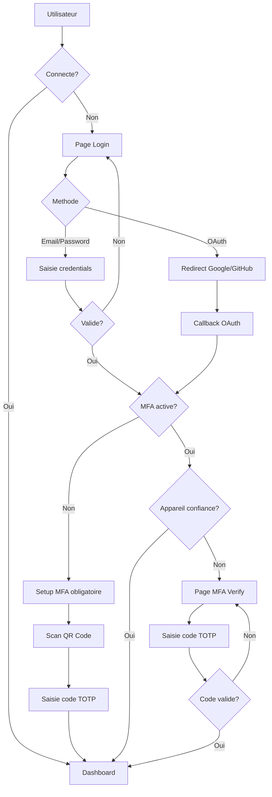

#  Frontend - Documentation Technique

Interface web du projet **SUPFile**.  
Basé sur **React 18 + Vite + TypeScript**.

---

## Stack technique

| Composant | Technologie |
|---|---|
| Framework | React 18 |
| Build tool | Vite |
| Langage | TypeScript |
| Routing | React Router v6 |
| State management | Zustand |
| Client HTTP | Axios (`services/api.ts`) |
| Styling | TailwindCSS |
| Internationalisation | i18next (FR / EN) |
| WebSockets | Socket.io-client (via `SocketListener.tsx`) |
| Icônes | Lucide React |
| Notifications | React Hot Toast |

---

## Flow d'authentification



---

## Choix UX/UI

### Design System

- **TailwindCSS** : Classes utilitaires pour un design coherent et rapide
- **Theme clair/sombre** : Variables CSS, persistance en base de donnees
- **Couleur principale** : Vert (#22c55e) - evoque la securite et l'ecologie
- **Icones** : Lucide React - coherentes et legeres

### Principes UX

| Principe | Implementation |
|---|---|
| Feedback immediat | Toast notifications, spinners, barres de progression |
| Actions reversibles | Corbeille 90 jours, confirmation avant suppression definitive |
| Accessibilite | Labels ARIA, navigation clavier, contraste suffisant |
| Mobile-first | Responsive design, touch-friendly |

### Interactions

- **Drag & drop** : Upload et deplacement de fichiers (HTML5 natif)
- **Clic droit** : Menu contextuel pour actions rapides
- **Raccourcis** : Ctrl+K recherche, Echap fermer modals
- **Temps reel** : Notifications WebSocket instantanees

### Stripe (mode test)

L'integration Stripe utilise des cles de test (`sk_test_*`). Les paiements ne sont pas reels. Cartes de test :
- `4242 4242 4242 4242` - Paiement reussi
- `4000 0000 0000 0002` - Paiement refuse

---

## Structure des dossiers

```
frontend/src/
 App.tsx              # Définition du routing React Router
 main.tsx             # Point d'entrée - BrowserRouter, i18n, stores
 components/          # Composants réutilisables
 pages/               # Pages (mappées aux routes)
 services/            # Clients HTTP (un par domaine métier)
 stores/              # État global Zustand
 hooks/               # Hooks personnalisés
 i18n/                # Configuration i18next + locales (fr/en)
 constants/           # Constantes (ex: plans)
 types/               # Types TypeScript partagés
 styles/              # CSS global
 utils/               # Utilitaires
```

---

## Routing (`App.tsx`)

### Routes publiques

| Route | Page | Description |
|---|---|---|
| `/login` | `LoginPage` | Connexion email/password ou OAuth2 |
| `/register` | `RegisterPage` | Inscription |
| `/mfa-verify` | `MFAVerificationPage` | Saisie du code TOTP lors du login |
| `/auth/callback` | `OAuthCallbackPage` | Callback OAuth2 Google/GitHub |
| `/share/:token` | `SharedLinkPage` | Accès à un lien de partage public (sans compte) |

### Routes protégées (`ProtectedRoute`)

Toutes les routes ci-dessous redirigent vers `/login` si l'utilisateur n'est pas authentifié.
Elles sont encapsulées dans le composant `Layout` (Header + Sidebar).

| Route | Page | Description |
|---|---|---|
| `/` |  redirect `/dashboard` | |
| `/dashboard` | `DashboardPage` | Tableau de bord (quota, fichiers récents, graphiques) |
| `/files` | `FilesPage` | Gestionnaire de fichiers (racine) |
| `/files/:folderId` | `FilesPage` | Gestionnaire de fichiers (dossier spécifique) |
| `/favorites` | `FavoritesPage` | Fichiers favoris |
| `/shared` | `SharedPage` | Partages reçus et envoyés |
| `/trash` | `TrashPage` | Corbeille |
| `/settings` | `SettingsPage` | Paramètres utilisateur |
| `/plans` | `PlansPage` | Abonnements et plans |
| `/organization-admin` | `OrganizationAdminPage` | Gestion des organisations |

### Route admin uniquement (`AdminRoute`)

| Route | Page | Description |
|---|---|---|
| `/admin` | `AdminPage` | Panneau super-administrateur |

---

## Pages

### `LoginPage`
Formulaire de connexion avec :
- Email / password
- Boutons OAuth2 (Google, GitHub)
- Gestion du flow MFA : si `mfaRequired`  redirige vers `/mfa-verify`, si `mfaSetupRequired`  ouvre `MFASetupModal`

### `RegisterPage`
Formulaire d'inscription (prénom, nom, email, password) avec validation.

### `MFAVerificationPage`
Page de saisie du code TOTP après login :
- Input 6 chiffres avec auto-submit
- Basculement vers code de récupération
- Checkbox "Se souvenir de cet appareil 30 jours"

### `DashboardPage`
Tableau de bord :
- Graphique de répartition du quota (par type de fichier : vidéo, image, doc, audio, autre)
- Quota utilisé / disponible
- 5 derniers fichiers modifiés
- Activités récentes

### `FilesPage`
Page principale du gestionnaire de fichiers :
- Navigation par dossiers avec fil d'Ariane (`Breadcrumb`)
- Affichage liste / grille des fichiers et dossiers
- Upload via bouton ou **drag & drop** (HTML5 natif, anti-conflit avec le déplacement)
- **Déplacement drag & drop** de fichiers et dossiers entre dossiers
- Création, renommage, suppression de dossiers
- Prévisualisation via `FilePreviewModal`
- Filtres avancés via `FilterBar` (type, date, tri)
- Tags via `TagSelector`
- Commentaires via `CommentsPanel`
- Versioning via `VersionHistory`
- Partage (lien public ou interne) via `ShareFileModal` / `ShareFolderModal`
- Téléchargement ZIP d'un dossier entier
- Gestion de l'`UploadModal`

### `FavoritesPage`
Liste des fichiers marqués favoris avec les mêmes actions que `FilesPage`.

### `SharedPage`
Gestion des partages :
- Onglets : Partagés avec moi (dossiers + fichiers), Partagés par moi, Liens publics
- Acceptation / refus des partages en attente (`PendingSharesModal`)
- Modification des permissions
- Révocation de partages
- Prévisualisation des fichiers partagés

### `TrashPage`
Corbeille avec restauration et suppression définitive (fichiers + dossiers).

### `SettingsPage`
Paramètres complets :
- Profil (avatar, nom, email, mot de passe)
- Thème clair / sombre
- Langue (FR/EN via i18next)
- **MFA** : `MFASettingsSection` (statut, setup, appareils de confiance, codes de secours)
- **Vault** : Configuration et gestion du coffre-fort
- **Organisations** : Création et gestion
- **Compte multi-accès** : Comptes liés, délégations
- **RGPD** : `RGPDSection` (export des données, suppression du compte)
- Logs d'activité : `ActivityLog`

### `PlansPage`
Presentation des plans FREE / PRO / Business avec souscription Stripe (mode test - cles `sk_test_*`).

### `AdminPage`
Panneau super-admin : gestion des utilisateurs, statistiques globales.

### `OrganizationAdminPage`
Gestion d'une organisation : membres, rôles, paramètres.

### `SharedLinkPage`
Accès public à un fichier/dossier partagé via token - sans compte requis.
Formulaire de mot de passe si lien protégé. Téléchargement ou prévisualisation.

### `OAuthCallbackPage`
Récupère le token JWT depuis l'URL après redirect OAuth2, le stocke et redirige vers `/dashboard`.

---

## Composants

### Navigation & Layout

| Composant | Rôle |
|---|---|
| `Layout` | Wrapper avec Header + Sidebar autour du contenu |
| `Header` | Barre supérieure : recherche globale, notifications, profil |
| `Sidebar` | Navigation latérale (Dashboard, Fichiers, Favoris, Partagés, Corbeille, Paramètres) |
| `Breadcrumb` | Fil d'Ariane dans le gestionnaire de fichiers |
| `ProtectedRoute` | Redirect `/login` si non authentifié |
| `AdminRoute` | Redirect `/` si non admin |

### Fichiers & Dossiers

| Composant | Rôle |
|---|---|
| `FilePreviewModal` | Visionneuse multi-format : image, PDF, vidéo (streaming), audio, Markdown, texte, OnlyOffice |
| `FileModals` | Modals de création/renommage de dossier et fichier |
| `FilterBar` | Barre de filtres : type, date, tri (nom, taille, date) |
| `UploadModal` | File picker + barre de progression par fichier |
| `VersionHistory` | Historique des versions d'un fichier avec restauration |
| `CommentsPanel` | Fil de commentaires d'un fichier avec réponses |
| `TagSelector` | Sélecteur de tags sur un fichier (depuis le store) |
| `TagsManager` | Interface de création / modification / suppression des tags |
| `MarkdownPreview` | Rendu Markdown avec syntax highlighting |
| `OfficePreview` | Intégration iframe OnlyOffice |
| `DocumentEditor` | Éditeur OnlyOffice avec callbacks de sauvegarde |

### Partage

| Composant | Rôle |
|---|---|
| `ShareFileModal` | Créer / gérer le partage d'un fichier (lien public + partage interne) |
| `ShareFolderModal` | Créer / gérer le partage d'un dossier |
| `PendingSharesModal` | Accepter ou refuser les partages reçus en attente |
| `AcceptedShares` | Liste des partages acceptés pour un fichier |
| `PermissionsManager` | Modifier les permissions d'un partage (lecture/écriture) |

### MFA & Sécurité

| Composant | Rôle |
|---|---|
| `MFASetupModal` | Setup MFA : affiche le QR code à scanner |
| `BackupCodesModal` | Affichage des codes de récupération (copie / téléchargement) |
| `MFASettingsSection` | Gestion MFA dans les paramètres (statut, appareils de confiance, désactivation) |

### Compte & Profil

| Composant | Rôle |
|---|---|
| `ProfileModal` | Modification de l'avatar, du nom et de l'email |
| `AccountSwitcherModal` | Interface multi-compte : lier des comptes, basculer entre eux, délégations |
| `RGPDSection` | Export des données + suppression du compte (RGPD) |

### Temps réel & Notifications

| Composant | Rôle |
|---|---|
| `SocketListener` | Écoute les événements Socket.io (upload, partage, notification) et met à jour les stores |
| `NotificationCenter` | Centre de notifications in-app avec marquage lu/non-lu |

### IA

| Composant | Rôle |
|---|---|
| `AIChatbot` | Interface chat de Bobby : historique de conversation, suggestions, RAG context |

### Divers

| Composant | Rôle |
|---|---|
| `ActivityLog` | Historique des actions de l'utilisateur (audit log) |

---

## Stores Zustand

| Store | État géré |
|---|---|
| `useAuthStore` | Utilisateur courant, token JWT, contexte de session (délégation), login/logout/register |
| `useFileStore` | Liste des fichiers, dossier courant, état de sélection |
| `useUploadStore` | File d'upload (fichiers en attente, progression, erreurs) |
| `useTagStore` | Tags de l'utilisateur (chargés une seule fois via flag `isLoaded` pour éviter les storm de requêtes) |
| `useNotificationStore` | Notifications in-app (liste, count non-lu) |
| `useVaultStore` | État du vault (ouvert / fermé, disponibilité) |

---

## Services frontend (clients HTTP)

Tous les services utilisent l'instance Axios centralisée (`services/api.ts`).

| Service | Endpoints couverts |
|---|---|
| `api.ts` | Instance Axios - intercepteur auth JWT, gestion 401 (redirect login ou `SESSION_EXPIRED`) |
| `authService` | login, register, getProfile, updateProfile, changePassword, exportData, OAuth2 |
| `fileService` | upload, list, search, get, download, stream, update, move, restore, favorite, delete, exportCsv |
| `folderService` | create, list, get, breadcrumbs, downloadZip, update, move, restore, delete |
| `shareService` | createLink, listLinks, deleteLink, shareFolder, shareFile, accept/reject, listShared, updatePermissions, accessStream |
| `aiService` | chat, analyzeFile, searchFiles, generateFile, reindex, conversations CRUD |
| `mfaService` | setup, verifySetup, verifyMFA, verifyBackupCode, regenerateCodes, trustedDevices, disable, status |
| `tagService` | createTag, getTags, updateTag, deleteTag, addToFile, removeFromFile, getFileTags, getFilesByTag |
| `commentService` | createComment, getComments, countComments, updateComment, deleteComment |
| `versionService` | getVersions, restoreVersion, deleteVersion |
| `vaultService` | status, setup, unlock, lock, rotatePassword |
| `auditService` | getUserLogs, getAdminLogs, exportCsv |
| `dashboardService` | getStats |
| `notificationService` | list, markRead |
| `userService` | search (pour le partage interne) |
| `adminService` | listUsers, updateUser, deleteUser, getStats |
| `organizationService` | listMine, create, get, addMember, updateRole, removeMember, switchCurrent |
| `accountAccessService` | switchLinks CRUD, switch, switchBack, delegations CRUD, assume |
| `billingService` | getPlan, subscribe |

---

## Hooks

| Hook | Rôle |
|---|---|
| `useSocket` | Connexion Socket.io avec authentification JWT, gestion reconnexion |

---

## Internationalisation (i18next)

- Langues supportées : **Français** (défaut) et **Anglais**
- Fichiers de traduction dans `i18n/locales/fr/` et `i18n/locales/en/`
- Changement de langue persisté dans les paramètres utilisateur

---

## Client HTTP (`services/api.ts`)

```
baseURL = VITE_API_URL + /api   (ou /api si non défini)
```

**Intercepteur request :**
- Injecte le JWT Bearer depuis `localStorage.getItem('token')`
- Bloque les requêtes HTTP non-localhost si `VITE_REQUIRE_HTTPS=true`

**Intercepteur response :**
- `401 + SESSION_EXPIRED`  redirige vers `/login?expired=true`
- `401` standard  supprime le token, redirige vers `/login`
- `401 + REAUTH_REQUIRED`  laisse passer (géré localement, ex: MFA)

---

## Variables d'environnement

```bash
VITE_API_URL=http://localhost:5001      # URL du backend (sans /api)
VITE_REQUIRE_HTTPS=false               # Bloquer les requêtes non-HTTPS
```

---

## Flow d'authentification complet

```
1. LoginPage  POST /api/auth/login
    Réponse: { token, user }           stocke token, redirige /dashboard
    Réponse: { mfaRequired, tempToken }  redirige /mfa-verify
    Réponse: { mfaSetupRequired, tempToken }  ouvre MFASetupModal

2. MFAVerificationPage  POST /api/mfa/verify
    Réponse: { token, user }           stocke token, redirige /dashboard

3. MFASetupModal  POST /api/mfa/setup  POST /api/mfa/verify-setup
    Réponse: { backupCodes, token }    ouvre BackupCodesModal

4. OAuthCallbackPage  extrait token depuis URL  setAuthToken  redirige /dashboard

5. Chaque requête API  Authorization: Bearer <token>
    401  logout + redirect /login
```
