# Manuel Utilisateur – SUPFile

---

## Sommaire

1. Introduction
2. Prerequis
3. Creation d'un compte
4. Connexion
5. Tableau de bord
6. Gestion des fichiers
7. Partage et collaboration
8. Bobby, l'assistant IA
9. Coffre-fort securise
10. Parametres du compte
11. SupFile Sync Windows
12. Plans et abonnements
13. Securite et confidentialite

---

## 1. Introduction

**SUPFile** est une plateforme francaise de stockage cloud souverain, concue pour stocker, organiser et partager vos fichiers en toute securite.

Accessible sur **https://supfile.tech/**, via application mobile (iOS/Android) et via le client Windows SupFile Sync, SUPFile permet de :

- Stocker vos fichiers en toute securite
- Organiser avec des dossiers et des tags colores
- Partager facilement avec vos proches ou collegues
- Collaborer avec des commentaires et des permissions
- Poser des questions a Bobby, l'assistant IA integre
- Proteger vos fichiers sensibles dans un coffre-fort chiffre
- Synchroniser automatiquement un dossier local Windows avec votre Drive

---

## 2. Prerequis

- **Navigateurs compatibles** : Chrome, Firefox, Edge, Safari
- **Mobile** : iOS 13+ ou Android 10+
- **SupFile Sync Windows** : Windows 10/11
- **Connexion Internet** requise
- **Un compte SUPFile** est obligatoire pour acceder a la plateforme

---

## 3. Creation d'un compte

### Sur le Web

1. Accedez a **https://supfile.tech/**
2. Cliquez sur **"S'inscrire"**
3. Remplissez le formulaire : Prenom, Nom, Email, Mot de passe
4. Cliquez sur **"S'inscrire"**
5. Vous pouvez aussi vous inscrire via **Google** ou **GitHub**

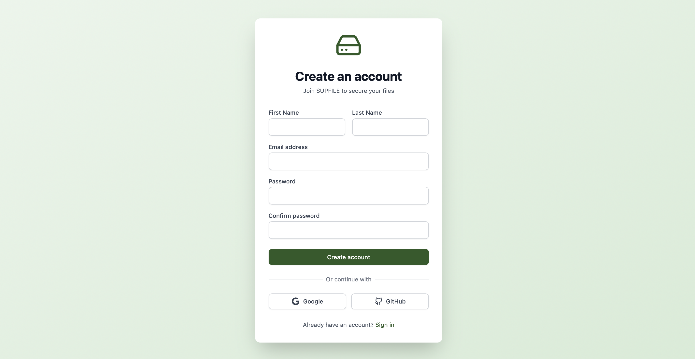

### Sur Mobile

1. Ouvrez l'application SUPFile
2. Appuyez sur **"S'inscrire"**
3. Remplissez vos informations
4. Appuyez sur le bouton bleu pour valider

### Configuration de la double authentification (obligatoire)

Apres l'inscription, vous devez configurer la **verification en deux etapes** :

1. Scannez le QR code avec une application comme **Google Authenticator** ou **Authy**
2. Entrez le code a 6 chiffres affiche dans l'application
3. **Conservez precieusement** vos codes de recuperation

**Etape 1 : QR Code**

**Etape 2 : Verification**

---

## 4. Connexion

### Sur le Web

1. Accedez a **https://supfile.tech/**
2. Entrez votre **email** et **mot de passe**
3. Cliquez sur **"Se connecter"**
4. Entrez le code de votre application d'authentification
5. Vous pouvez aussi vous connecter via **Google** ou **GitHub**

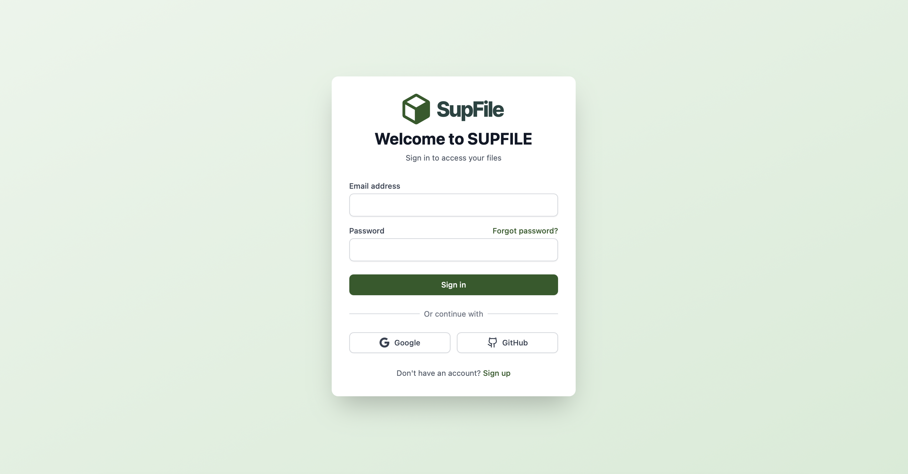

### Sur Mobile

1. Ouvrez l'application
2. Entrez vos identifiants
3. Appuyez sur **"Se connecter"**

### Mot de passe oublie ?

1. Cliquez sur **"Mot de passe oublie ?"**
2. Entrez votre adresse email
3. Vous recevrez un lien pour reinitialiser votre mot de passe

---

## 5. Tableau de bord

Apres connexion, vous arrivez sur votre **tableau de bord** qui affiche :

- Un message de bienvenue personnalise
- Vos **statistiques** : nombre de fichiers, espace utilise
- Un **graphique** de repartition par type de fichier
- Vos **fichiers recents** pour un acces rapide

**Dashboard Web**

**Dashboard Mobile**

---

## 6. Gestion des fichiers

### Naviguer dans vos fichiers

Vos fichiers sont organises en dossiers. Utilisez le **fil d'Ariane** en haut pour naviguer (ex: Mes fichiers > Projets > Photos).

**Vue Web**

**Vue Mobile**

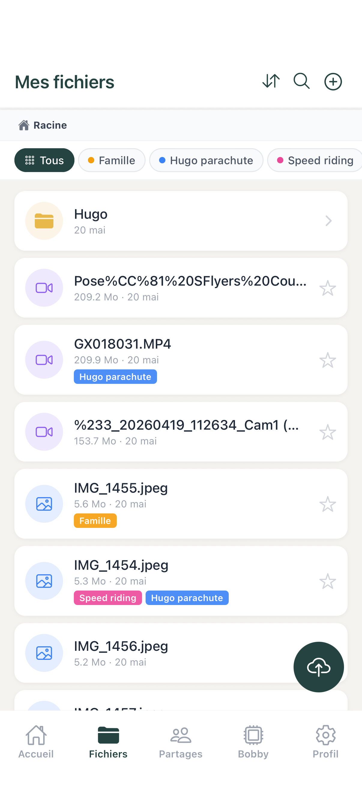

### Envoyer des fichiers

**Sur le Web :**
- Cliquez sur le bouton **"Upload"**
- Ou **glissez-deposez** vos fichiers directement

**Sur Mobile :**
- Appuyez sur le bouton **"+"**
- Choisissez depuis la galerie, l'appareil photo ou les fichiers

### Creer un dossier

1. Cliquez/appuyez sur **"Nouveau dossier"**
2. Donnez-lui un nom
3. Validez

**Nouveau dossier Web**

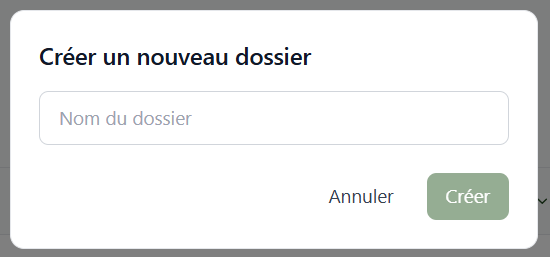

**Nouveau dossier Mobile**

### Actions sur un fichier

Cliquez droit (Web) ou appuyez longuement (Mobile) sur un fichier pour :

- **Renommer**
- **Deplacer**
- **Telecharger**
- **Partager**
- **Ajouter aux favoris**
- **Ajouter des tags**
- **Voir les versions**
- **Supprimer**

**Actions sur un fichier**

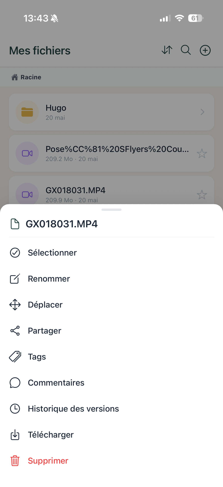

**Actions sur un dossier**

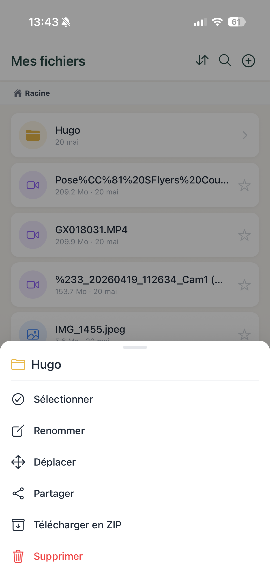

### Previsualiser un fichier

Cliquez sur un fichier pour l'ouvrir en plein ecran :
- **Images** : zoom disponible
- **PDF** : visionneuse integree
- **Documents Office** : apercu direct
- **Videos/Audio** : lecture integree

### Organiser avec des tags

Les **tags colores** vous aident a organiser vos fichiers :

1. Selectionnez un fichier
2. Cliquez sur **"Tags"**
3. Creez ou selectionnez un tag
4. Choisissez une couleur

**Creation de tag**

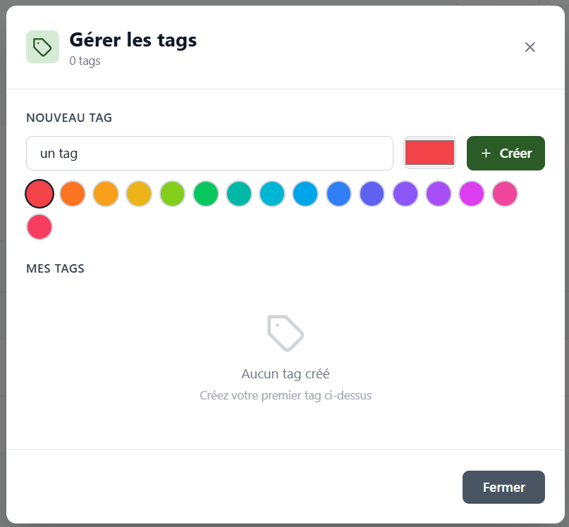

**Selection de tags**

### Fichiers favoris

Marquez vos fichiers importants avec une **etoile** pour les retrouver rapidement dans la section **Favoris**.

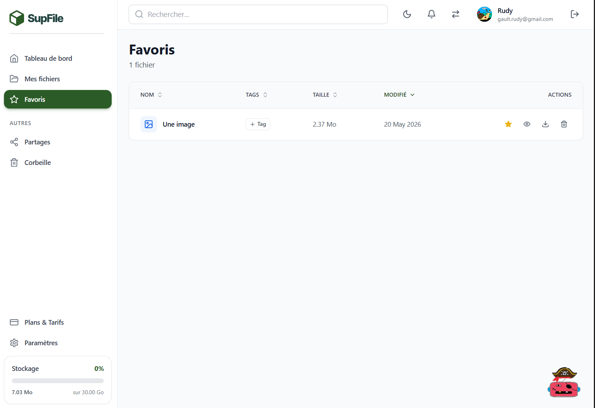

### Corbeille

Les fichiers supprimes vont dans la **corbeille**. Vous pouvez :
- **Restaurer** un fichier
- **Supprimer definitivement**
- **Vider la corbeille**

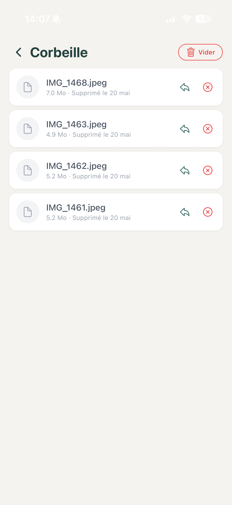

---

## 7. Partage et collaboration

### Partager par lien

Creez un **lien de partage** que n'importe qui peut utiliser :

1. Selectionnez un fichier
2. Cliquez sur **"Partager"**
3. Choisissez l'onglet **"Lien public"**
4. Configurez les options :
   - Protection par mot de passe (PRO)
   - Date d'expiration
   - Nombre max de telechargements
5. Copiez le lien

**Partage Web**

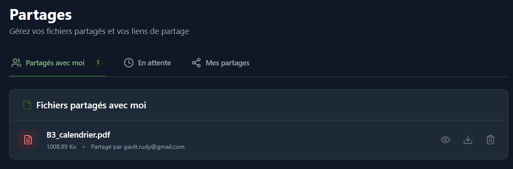

**Partage Mobile**

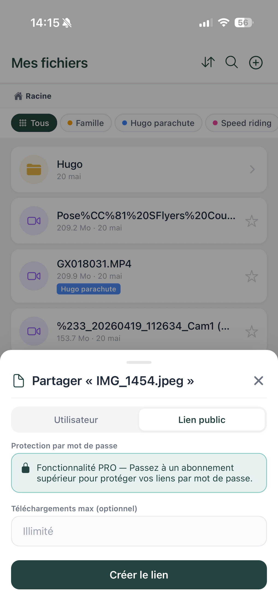

### Partager avec un utilisateur

Partagez directement avec un autre utilisateur SUPFile :

1. Selectionnez un fichier
2. Cliquez sur **"Partager"**
3. Entrez l'email de la personne
4. Choisissez les **permissions** :
   - Lecture
   - Modification
   - Suppression
   - Repartage

**Permissions de partage**

**Partage utilisateur Mobile**

### Gerer les partages recus

Retrouvez tous vos partages dans la section **"Partages"** :

- **En attente** : invitations a accepter ou refuser
- **Avec moi** : fichiers partages par d'autres
- **Par moi** : fichiers que vous avez partages

**Partages Web**

**Partages Mobile**

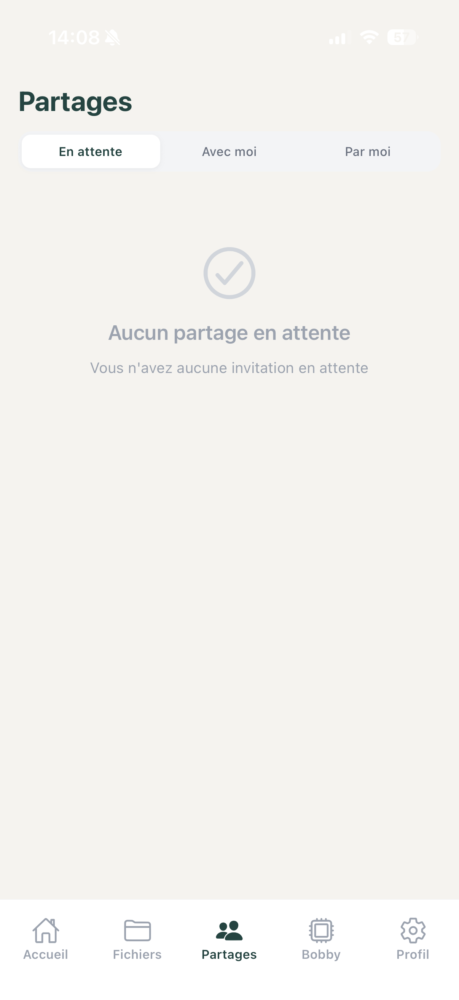

### Commenter un fichier

Ajoutez des **commentaires** sur les fichiers partages pour collaborer :

1. Ouvrez un fichier
2. Cliquez sur **"Commentaires"**
3. Redigez votre message
4. Envoyez

**Commentaires Web**

**Commentaires Mobile**

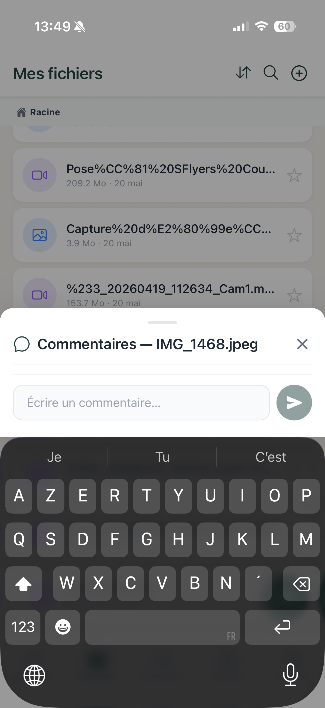

---

## 8. Bobby, l'assistant IA

**Bobby** est votre assistant intelligent integre (disponible avec le plan PRO).

### Discuter avec Bobby

1. Allez dans l'onglet **"Bobby"**
2. Posez votre question en langage naturel
3. Bobby vous repond !

**Exemples de questions :**
- "Resume ce document"
- "Quels sont les points cles de ce PDF ?"
- "Genere un document sur [sujet]"

**Bobby Web**

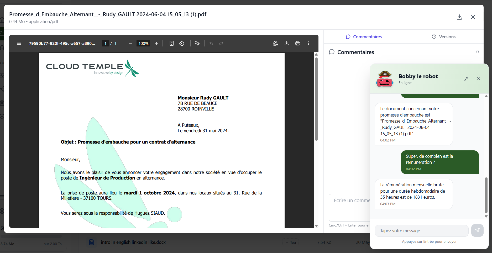

**Bobby Mobile**

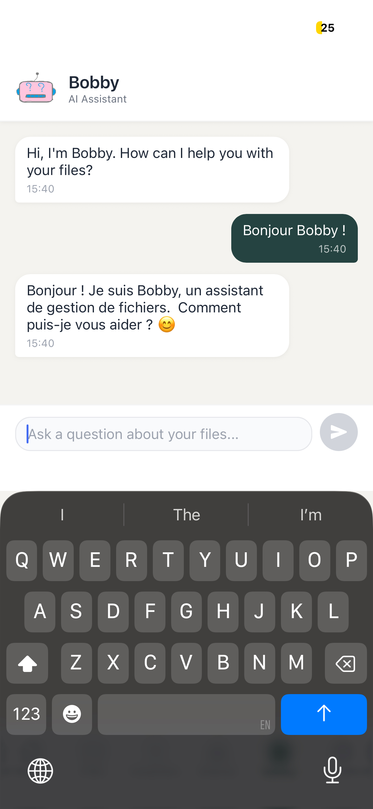

### Analyser un fichier

1. Ouvrez un fichier (PDF, Word, Excel...)
2. Cliquez sur **"Analyser avec Bobby"**
3. Bobby vous donne un resume et les points importants

### Recherche intelligente

Activez la **recherche IA** pour poser des questions en langage naturel :
- "Trouve mes factures de janvier"
- "Ou sont les photos de vacances ?"

**Note** : Si vous avez un plan FREE, Bobby affiche un message vous invitant a passer au plan PRO.

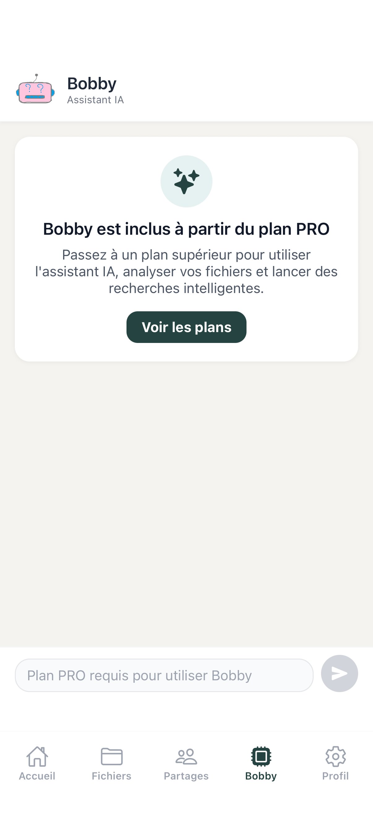

---

## 9. Coffre-fort securise

Le **coffre-fort** offre une protection supplementaire pour vos fichiers sensibles (disponible avec le plan PRO).

### Comment ca marche ?

Vos fichiers dans le coffre-fort sont proteges par un **second mot de passe**, different de celui de votre compte.

### Configurer le coffre-fort

1. Allez dans **Parametres > Coffre-fort**
2. Creez un mot de passe dedie
3. Entrez votre code d'authentification

### Utiliser le coffre-fort

1. Cliquez sur **"Deverrouiller"**
2. Entrez votre mot de passe coffre-fort + code
3. Accedez a vos fichiers proteges
4. Le coffre se **reverrouille automatiquement** apres un delai

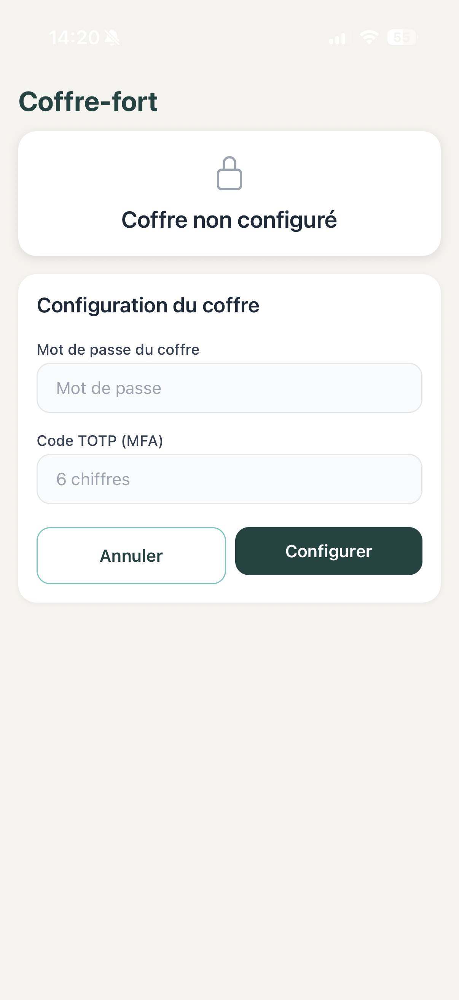

---

## 10. Parametres du compte

Accedez aux parametres en cliquant sur votre **avatar** ou l'icone **engrenage**.

### Modifier votre profil

- Changer votre **photo de profil**
- Modifier votre **nom**
- Voir votre **espace de stockage** utilise

**Parametres Web**

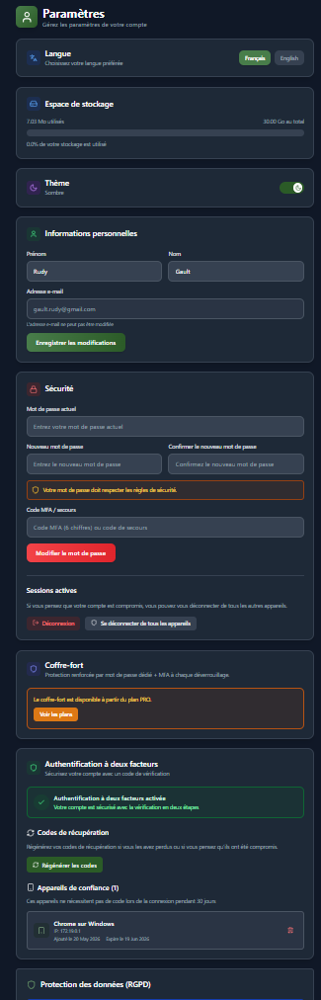

**Parametres Mobile**

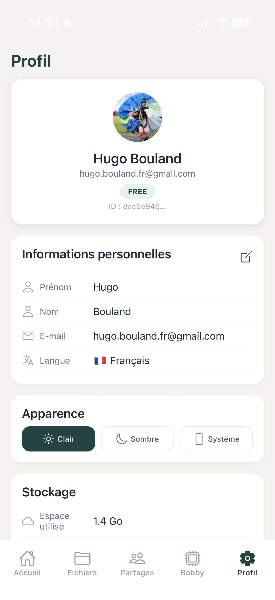

### Changer de mot de passe

1. Allez dans **Parametres > Securite**
2. Entrez votre mot de passe actuel
3. Entrez le nouveau mot de passe (2 fois)
4. Validez avec votre code d'authentification

### Theme clair / sombre

Basculez entre le **mode clair** et le **mode sombre** selon vos preferences.

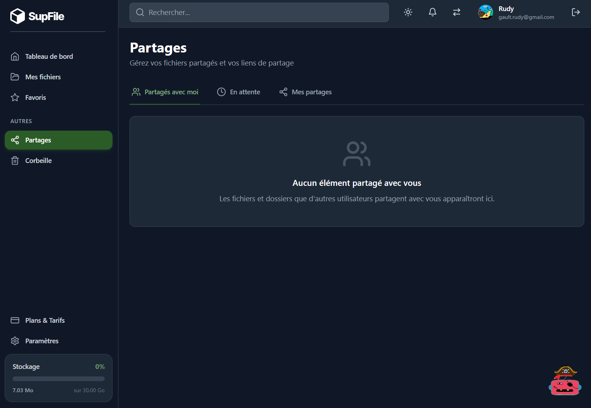

### Gerer la double authentification

- Voir vos **appareils de confiance**
- **Regenerer** vos codes de recuperation
- **Desactiver** la double authentification (non recommande)

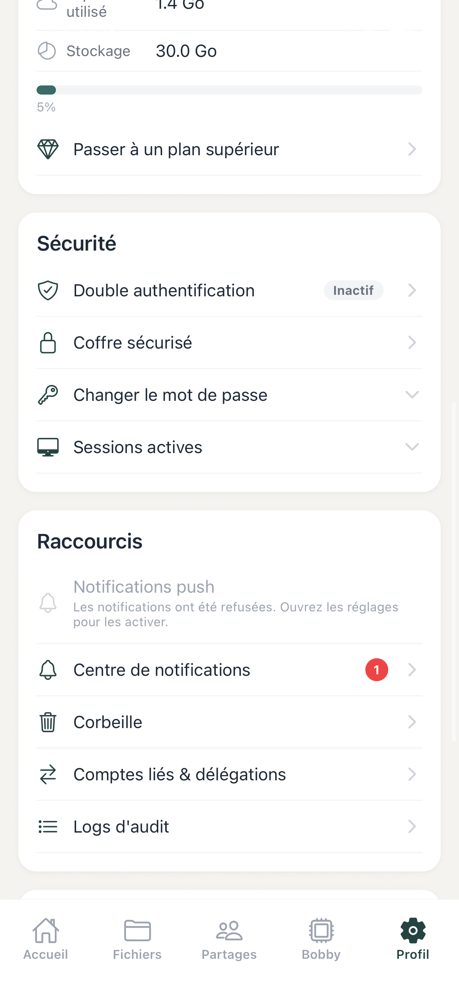

### Exporter vos donnees (RGPD)

Telechargez une copie de toutes vos donnees personnelles.

### Supprimer votre compte

Supprimez definitivement votre compte et toutes vos donnees.

---

## 11. SupFile Sync Windows

SupFile Sync Windows est le client desktop qui synchronise automatiquement un dossier de votre PC avec votre Drive SUPFile.

### Installer le client

1. Ouvrez SUPFile dans le navigateur.
2. Allez dans **Parametres**.
3. Dans la section **SupFile Sync pour Windows**, cliquez sur **Telecharger le .exe**.
4. Lancez `SupFile-Sync-Setup.exe`.
5. Ouvrez l'application **SupFile Sync** apres installation.

### Premiere connexion

1. Renseignez l'URL du backend SUPFile, par exemple `http://localhost:5001` en local.
2. Connectez-vous avec votre email et votre mot de passe.
3. Validez le MFA si demande.
4. Choisissez le dossier local a synchroniser.

L'application cree ou recupere automatiquement un dossier distant nomme **SupFile Sync**. Les fichiers ajoutes localement apparaissent ensuite dans le web, et les fichiers ajoutes dans ce dossier web sont telecharges localement.

### Comportement attendu

- La synchronisation est bidirectionnelle : local vers web et web vers local.
- Les suppressions locales vont dans la corbeille SUPFile.
- Les suppressions web sont deplacees vers la corbeille Windows, ou vers `.supfile-sync/trash` si la corbeille est indisponible.
- Le mode pause empeche temporairement les transferts.
- En cas de conflit, SUPFile garde les deux versions avec un fichier suffixe `(conflit ...)`.
- Si vous etes hors ligne, l'application reprend la synchronisation lorsque le backend redevient accessible.

---

## 12. Plans et abonnements

SUPFile propose plusieurs plans adaptes a vos besoins :

**FREE** : 30 Go de stockage

**PRO** : Stockage augmente + Bobby IA + Coffre-fort

**BUSINESS** : Tout PRO + Organisations

**ENTERPRISE** : Sur mesure

### Changer de plan

1. Allez dans **Parametres > Abonnement**
2. Choisissez votre nouveau plan
3. Procedez au paiement securise via Stripe

**Plans Web**

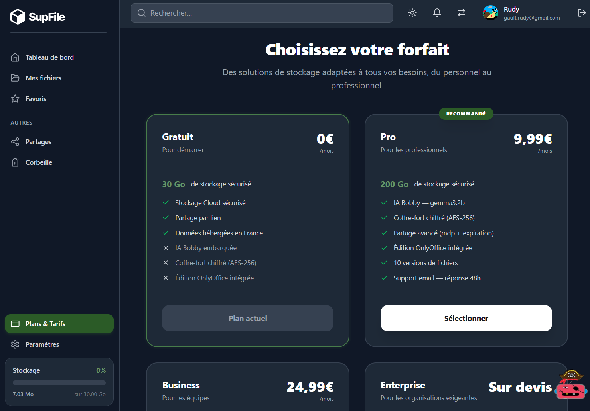

**Plans Mobile**

---

## 13. Securite et confidentialite

SUPFile garantit la **securite** et la **confidentialite** de vos donnees :

- **Chiffrement** de tous vos fichiers
- **Stockage en France** sur nos propres serveurs
- **Double authentification** obligatoire
- **Aucune dependance** aux geants americains (GAFAM)
- **Conformite RGPD** : export et suppression de donnees a la demande
- **IA 100% locale** : vos fichiers ne quittent jamais nos serveurs

---

## Notifications

Restez informe grace aux **notifications** :

- Nouveau partage recu
- Nouveau commentaire
- Espace de stockage presque plein

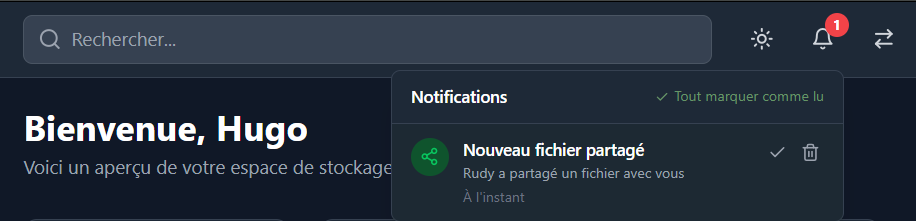

Activez les notifications push sur mobile pour ne rien manquer !

---

## Deconnexion

Pour vous deconnecter :
1. Cliquez sur votre **avatar**
2. Selectionnez **"Deconnexion"**

---

## Mise a jour du manuel

**Derniere mise a jour** : Mai 2026

Ce manuel evoluera selon les futures fonctionnalites de SUPFile.

---

**Auteurs** : Paul Mazzon, Rudy Gault, Mathis Malzac, Hugo Bouland

**Projet** : 4PROJ – SUPINFO 2025-2026
