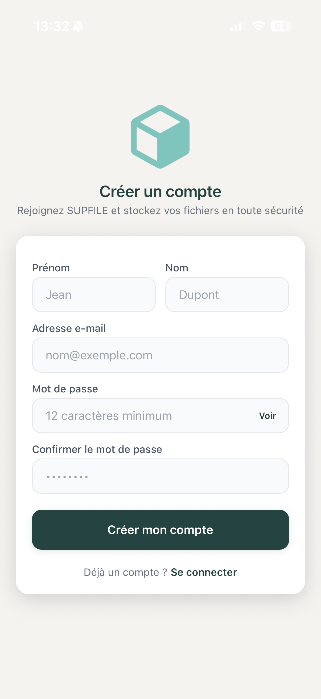
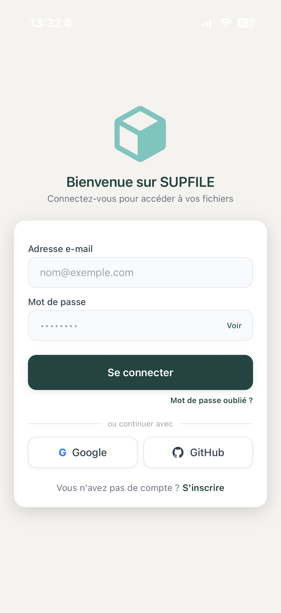
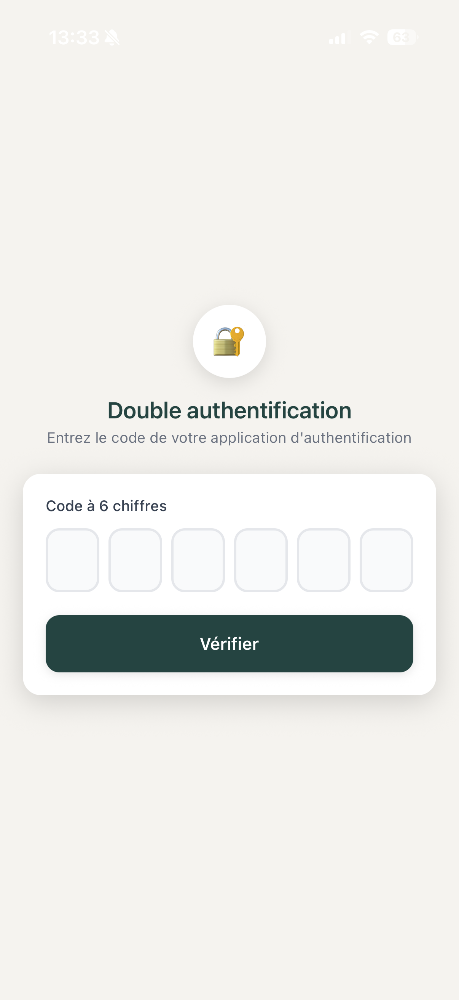
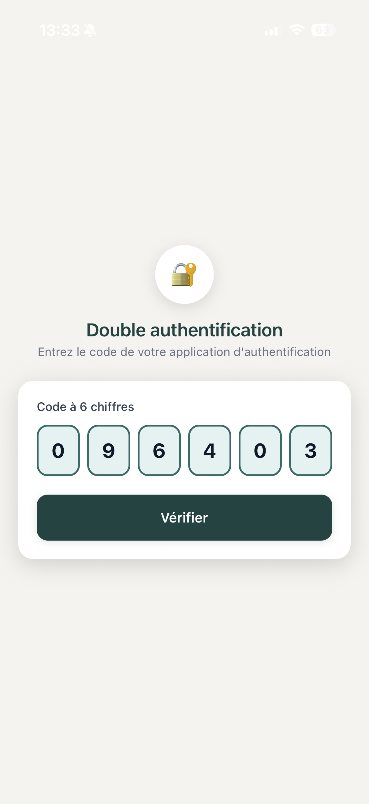
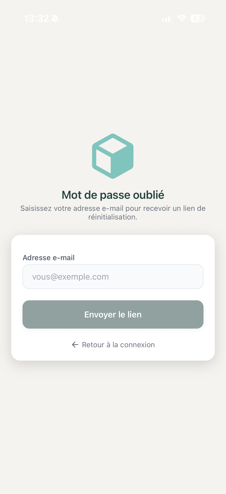

# 3. Parcours d'Authentification

[< Retour au sommaire](README.md) | [< Architecture](02-architecture.md)

---

L'authentification est au coeur de la securite de SUPFile. La plateforme impose le **MFA obligatoire** pour tous les utilisateurs et supporte plusieurs methodes de connexion.

---

## 3.1 Inscription — Web

**Chemin :** `/register`

### Elements de l'interface
- **Logo SUPFile** : centre en haut (`icon-full.svg`, 192px)
- **Formulaire 4 champs** : Prenom, Nom, Email, Mot de passe
- **Bouton "S'inscrire"** : fond bleu primaire `#4F46E5`
- **Separateur** "ou continuer avec" + boutons OAuth Google / GitHub
- **Lien** "Deja un compte ? Se connecter" en bas
- **Indicateur de force** du mot de passe en temps reel (rouge → orange → vert)

### Comportement
- **Si succes** : redirection vers la configuration MFA obligatoire
- **Si erreur** : toast rouge "Cet email est deja utilise"

---

## 3.1b Inscription — Mobile (RegisterScreen)

### Elements de l'interface
- Card blanche avec ombre (`shadows.xl`) sur fond gris clair
- Logo SUPFile (80x80px) + titre en violet primaire `#4F46E5`
- 4 champs : Prenom, Nom, Email, Mot de passe (avec oeil pour afficher/masquer)
- Bouton bleu pleine largeur + boutons OAuth Google / GitHub
- `KeyboardAvoidingView` : clavier automatiquement evite

*Ecran d'inscription mobile avec formulaire et boutons OAuth*

---

## 3.2 Connexion — Web

**Chemin :** `/login`

### Elements de l'interface
- Logo `icon-full.svg` (mode clair) / `icon-full-light.svg` (mode sombre)
- Email + Mot de passe (lien "Mot de passe oublie ?" a droite)
- Bouton "Se connecter" : fond bleu `bg-primary-600`
- Boutons OAuth Google / GitHub + lien S'inscrire

### Gestion des cas
- Session expiree
- Compte supprime
- MFA requis

---

## 3.2b Connexion — Mobile (LoginScreen)

### Elements de l'interface
- Logo (80px) centre + card blanche avec ombre
- Champ mot de passe : bouton Voir/Masquer + spinner si chargement
- Boutons OAuth + lien "Mot de passe oublie ?"

*Ecran de connexion mobile avec formulaire et boutons OAuth*

---

## 3.3 Authentification Multi-Facteurs (MFA) — TOTP

**MFA OBLIGATOIRE** sur toute la plateforme. La modale `MFASetupModal` s'ouvre automatiquement a la premiere connexion.

### Web — Modale MFASetupModal

| Etape | Description |
|-------|-------------|
| **Etape 1** | QR Code a scanner dans Google Authenticator, Authy, etc. |
| **Etape 2** | Code secret affiche en clair pour saisie manuelle |
| **Etape 3** | Champ TOTP 6 chiffres + bouton "Activer MFA" |

Apres validation : modale `BackupCodesModal` avec **10 codes de secours** (avertissement rouge)

### Mobile — Configuration MFA

- Bouton "Ajouter a l'application d'authentification"
- Code secret affiche en texte + bouton Copier
- Avertissement jaune : "Conservez ce code en lieu sur"
- 6 cases de saisie TOTP + bouton Verifier

| Etape 1 | Etape 2 |
|---------|---------|
|  |  |

*Configuration MFA sur mobile : QR code et saisie du code TOTP*

---

## 3.4 Connexion OAuth2 (Google / GitHub)

### Flux
1. Clic sur Google/GitHub → navigateur OAuth du fournisseur
2. Connexion automatique si compte existant, sinon creation automatique + MFA

---

## 3.5 Reinitialisation du Mot de Passe

### Web

| Chemin | Elements |
|--------|----------|
| `/forgot-password` | Champ email + bouton "Envoyer le lien de reinitialisation" |
| `/reset-password?token=...` | Champ nouveau mot de passe + confirmation + indicateur de force |

### Mobile
- `ForgotPasswordScreen` et `ResetPasswordScreen` (card blanche centree)

*Ecran de reinitialisation du mot de passe sur mobile*

---

[Section suivante : Dashboard →](04-dashboard.md)
