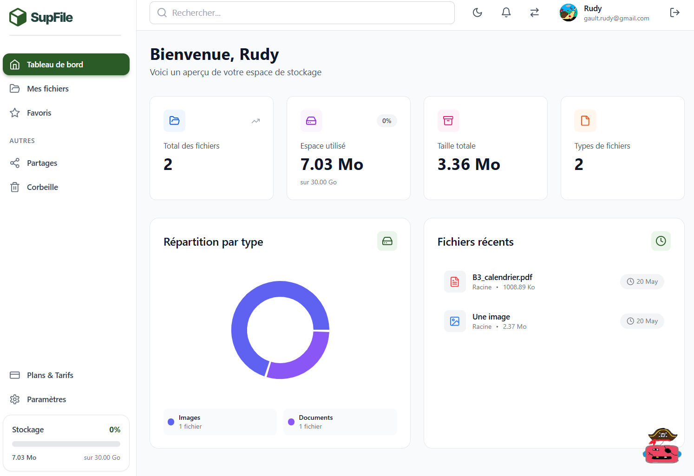
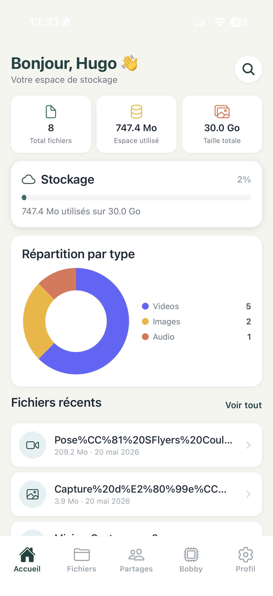

# 4. Tableau de Bord (Dashboard)

[< Retour au sommaire](README.md) | [< Authentification](03-authentification.md)

---

## 4.1 Dashboard Web

**Chemin :** `/dashboard`

### Layout
- Sidebar gauche (navigation)
- Header
- Contenu principal

### Elements de l'interface

#### En-tete
- "Bonjour, [Prenom] !" (`text-3xl font-bold`) + sous-titre

#### 4 Stats Cards
| Carte | Description |
|-------|-------------|
| Total Fichiers | Nombre total de fichiers |
| Stockage Utilise | Espace consomme |
| Taille Totale | Volume total des fichiers |
| Types de Fichiers | Repartition par type |

#### Visualisation
- **Pie Chart** (Recharts) : repartition par type avec legende coloree

#### Fichiers recents
- Liste avec icone typee, nom, taille, date
- Clic → previsualisation

#### Sidebar
- Logo
- Liens navigation
- Avatar
- Plan actuel
- Barre de stockage mini

#### ActivityLog (PRO)
- Journal d'activite en temps reel via Socket.io

*Dashboard Web complet avec sidebar, statistiques et graphique de repartition*

---

## 4.2 Dashboard Mobile (DashboardScreen)

### Elements de l'interface

#### Header
- Salutation en violet primaire
- Bouton loupe a droite

#### 3 cartes statistiques
| Carte | Description |
|-------|-------------|
| Fichiers | Nombre total |
| Espace utilise | Volume consomme |
| Espace total | Quota disponible |

#### Barre de stockage
| Niveau | Couleur |
|--------|---------|
| < 70% | Bleue |
| 70-90% | Orange |
| > 90% | Rouge |

#### Visualisation
- **PieChart SVG** (160px) : slices colorees par type de fichier

#### Fichiers recents
- Icone typee
- Nom tronque
- Taille + date
- Chevron de navigation

#### Interactions
- **Pull-to-refresh** : geste vers le bas pour actualiser

*Dashboard Mobile avec statistiques, quota de stockage et fichiers recents*

---

[Section suivante : Gestion des Fichiers →](05-gestion-fichiers.md)
