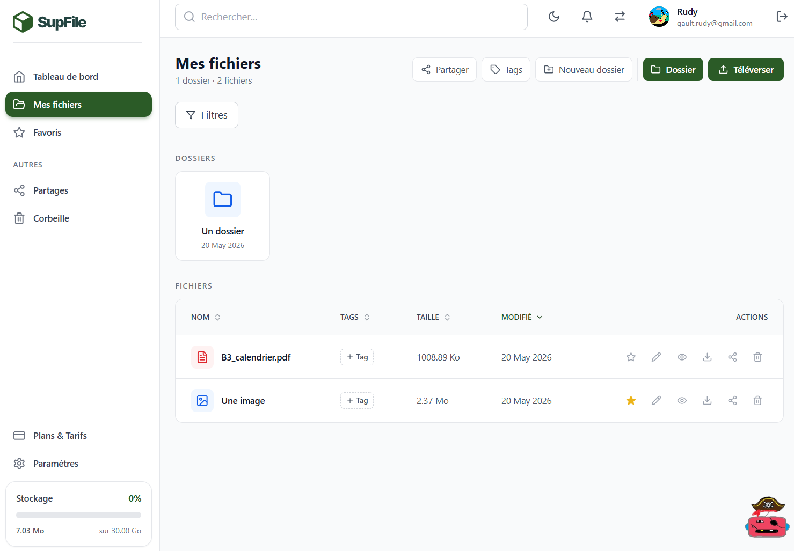
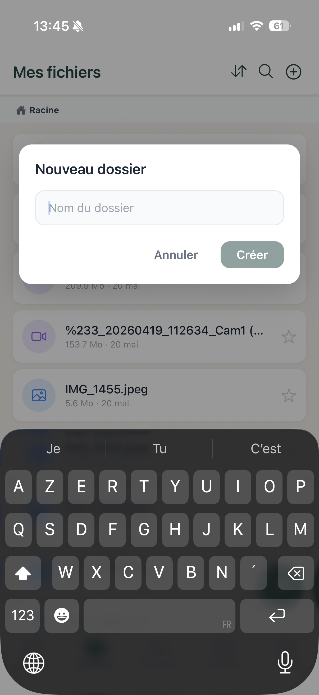
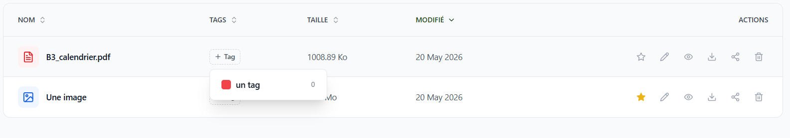
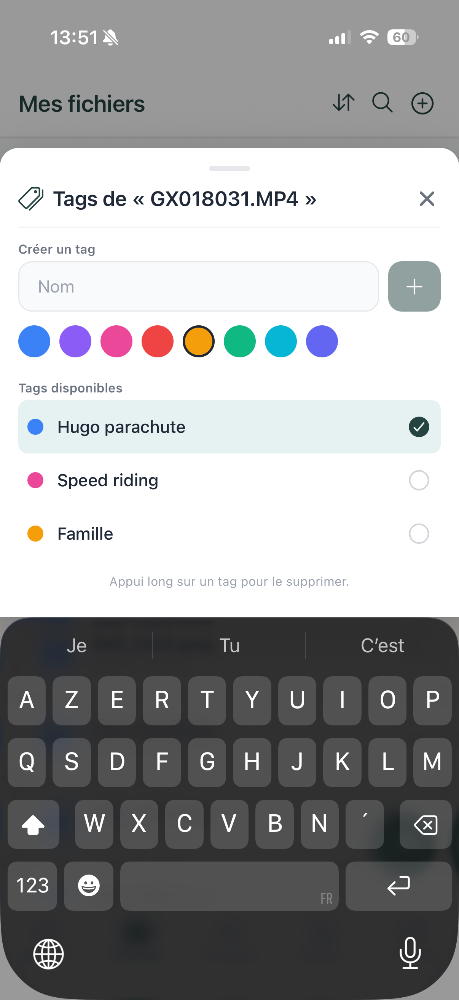
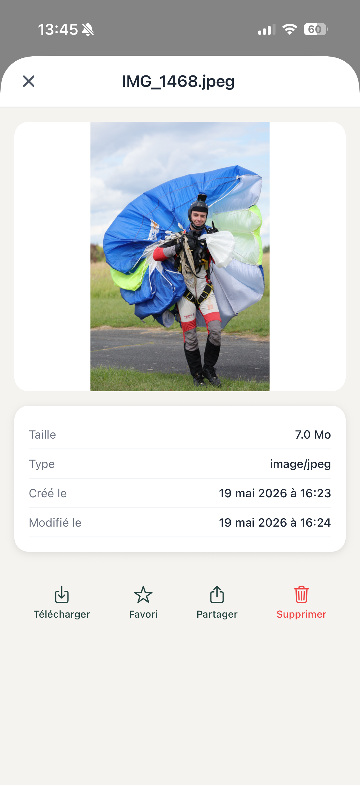

# 5. Gestion des Fichiers et Dossiers

[< Retour au sommaire](README.md) | [< Dashboard](04-dashboard.md)

---

## 5.1 Navigation dans les fichiers — Web

**Chemin :** `/files` ou `/files/:folderId`

### Elements de l'interface

#### Breadcrumbs
Exemple : `Mes fichiers > Projets > SUPFile > Assets`

#### Barre d'actions
- Upload
- Nouveau dossier
- Rechercher
- Trier
- Filtrer

#### Modes d'affichage
| Mode | Description |
|------|-------------|
| Grille | Affichage en cards |
| Liste | Affichage en tableau |

#### Actions sur un fichier
- Renommer
- Deplacer
- Telecharger
- Partager
- Favoris
- Tag
- Versions
- Commentaires
- Supprimer

#### Selection multiple
- Cases a cocher
- Barre batch : deplacer, supprimer, telecharger ZIP

#### Drag & drop
Glisser-deposer depuis le bureau

*Vue des fichiers Web avec navigation et barre d'actions*

---

## 5.1b Navigation dans les fichiers — Mobile (FilesScreen)

### Elements de l'interface

#### Header sticky
- "Mes Fichiers"
- Boutons tri/recherche/ajout

#### Breadcrumbs scrollables
Exemple : `Racine > Projets > Images`

#### Tags en bandeau
- Tous / Famille / Hugo parachute / Speed riding
- Filtrage instantane

#### Affichage fichier
- Icone typee
- Nom tronque
- Taille + date
- Etoile favori
- Tags colores sous le nom

*Vue des fichiers Mobile avec tags colores et filtres*

---

## 5.2 Upload de fichiers

### Web
- Bouton Upload → selecteur de fichiers systeme
- Drag & drop directement sur la zone de fichiers
- Barre de progression par fichier + indicateur global en pourcentage
- Upload multiple simultane + toast de succes

### Mobile
- Bouton **+** dans le header : ActionSheet → galerie photos / appareil photo / Fichiers
- Progression affichee dans une barre en haut de l'ecran

---

## 5.3 Creation de dossiers

### Interface
- Bouton "Nouveau dossier" dans la barre d'actions (Web) ou header (Mobile)
- Modale `NewFolderModal` : champ nom + bouton Annuler / Creer
- Validation en temps reel
- Apparition instantanee sans rechargement

| Web | Mobile |
|-----|--------|
|  |  |

*Creation d'un nouveau dossier sur Web et Mobile*

---

## 5.4 Renommer et Deplacer

### Web
| Action | Interface |
|--------|-----------|
| Renommer | Menu contextuel → champ inline ou modale |
| Deplacer | Menu 3 points → modale avec arborescence navigable |

### Mobile — ItemActionsSheet
Bottom sheet avec toutes les options par appui long :

#### Options fichier
- Selectionner
- Renommer
- Deplacer
- Partager
- Tags
- Commentaires
- Versions
- Telecharger
- Supprimer

#### Options dossier
- Selectionner
- Renommer
- Deplacer
- Partager
- Telecharger en ZIP
- Supprimer

| Actions Fichier | Actions Dossier |
|-----------------|-----------------|
|  |  |

*Menu d'actions sur fichier et dossier (Mobile)*

---

## 5.5 Suppression et Corbeille

### Comportement
**Suppression soft delete** : element envoye a la corbeille, pas supprime definitivement.

### Web — `/trash`
- Liste avec date de suppression
- Bouton Restaurer
- Bouton Supprimer definitivement
- Bouton "Vider la corbeille" en haut

### Mobile — TrashScreen
- Liste avec icone fleche retour (restaurer) et croix rouge (supprimer)
- Bouton "Vider" en haut a droite

*Corbeille Mobile avec options de restauration et suppression*

---

## 5.6 Fichiers Favoris

### Web (`/favorites`)
- Etoile jaune
- Page dedicee dans la sidebar
- Toggle instant

### Mobile
- Etoile accessible depuis chaque item de la liste de fichiers

*Page des favoris Web*

---

## 5.7 Versions des fichiers

### Web — VersionHistory
- Panel lateral
- Liste chronologique des versions (date, taille, version actuelle)
- Actions : Restaurer ou Supprimer une version specifique

### Mobile — VersionsPanel
- Bottom sheet avec meme fonctionnalite

---

## 5.8 Tags et organisation

### Web
- Creation depuis Parametres ou depuis un fichier directement
- Chaque tag : nom + couleur (palette)
- `TagSelector` : dropdown pour ajouter/retirer — badges colores dans la liste

| Creation de tag | Vue des tags |
|-----------------|--------------|
|  |  |

*Creation et visualisation des tags (Web)*

### Mobile — TagsPicker
- Bottom sheet : palette de couleurs + champ nom + bouton +
- Tags disponibles avec toggle (coche) pour ajouter/retirer
- Appui long sur un tag pour le supprimer

*Selection des tags sur Mobile avec palette de couleurs*

---

## 5.9 Previsualisation des fichiers

### Web — FilePreviewModal + OfficePreview

| Type | Comportement |
|------|-------------|
| Images | Affichage direct avec zoom |
| PDF | Visionneuse PDF integree |
| Office (Word, Excel, PPT) | Previsualisation via OnlyOffice integre |
| Videos / Audio | Lecteurs HTML5 natifs |

#### Header
- Nom, taille, date
- Boutons Telecharger / Partager / Fermer

### Mobile — FilePreviewModal
- Modale plein ecran + pinch-to-zoom pour images
- Barre inferieure : Telecharger / Favori / Partager / Supprimer
- Infos fichier : Taille, Type, Cree le, Modifie le

*Previsualisation d'image sur Mobile avec actions*

---

## 5.10 Telechargement

### Options de telechargement
| Element | Methode |
|---------|---------|
| Menu contextuel | Clic droit ou menu 3 points |
| Barre batch | Selection multiple |
| Previsualisation | Bouton Telecharger |

### Comportements
| Type | Resultat |
|------|----------|
| Dossier entier | Telecharge en ZIP (`GET /api/folders/:folderId/download`) |
| Fichier unique | Telechargement direct — dechiffre a la volee |
| Selection multiple | Batch ZIP genere cote serveur |

---

[Section suivante : Partage et Collaboration →](06-partage-collaboration.md)
