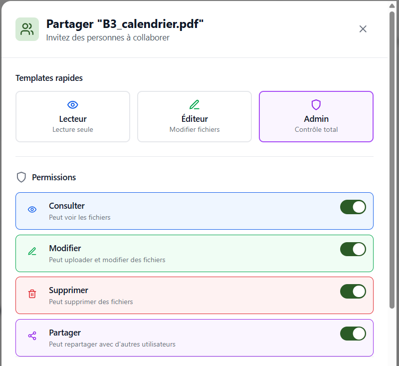
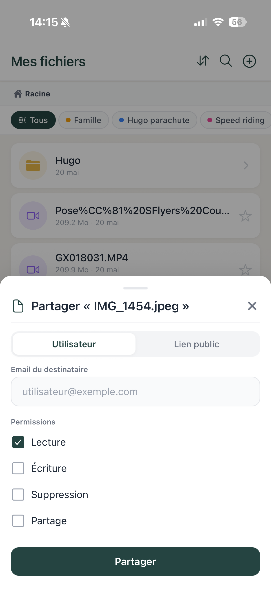
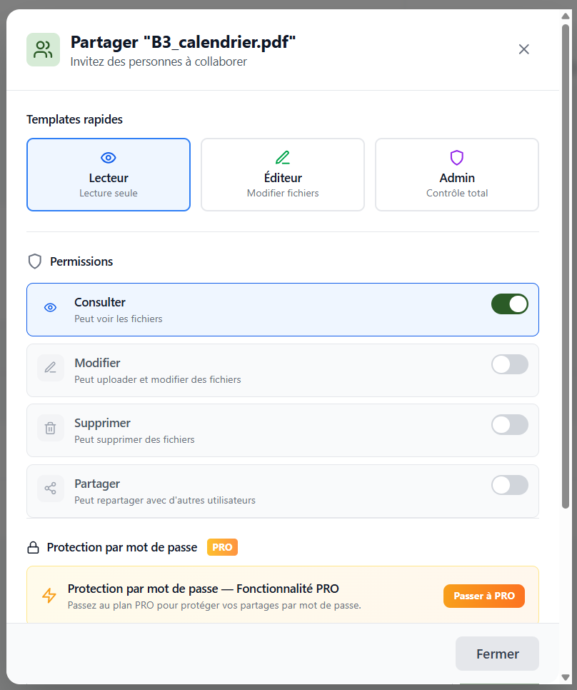
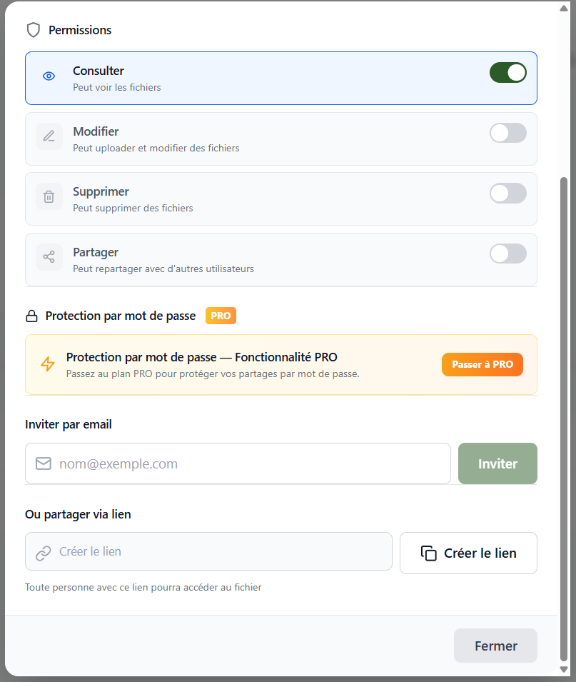
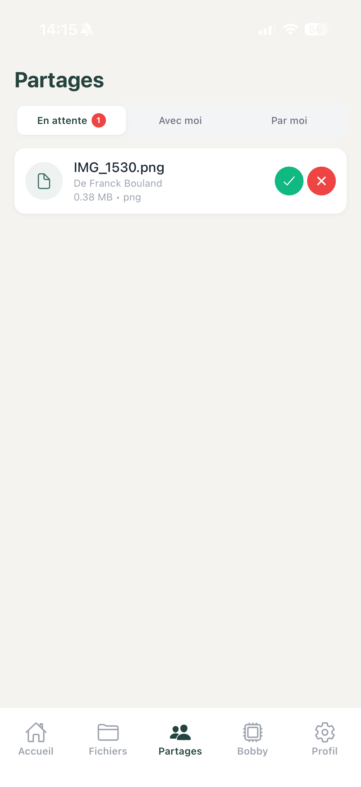
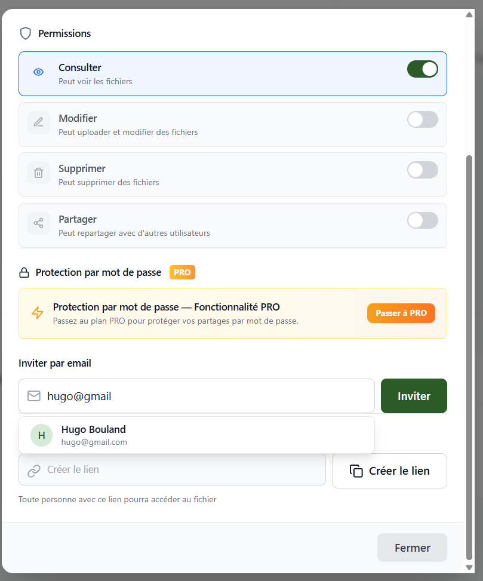
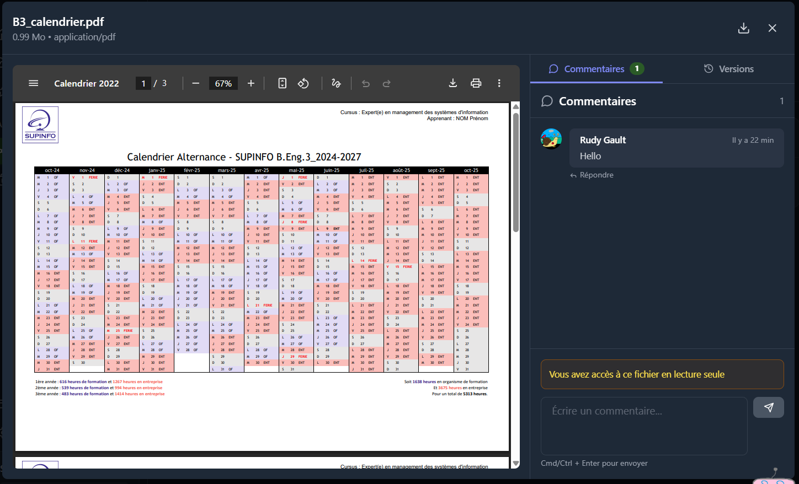
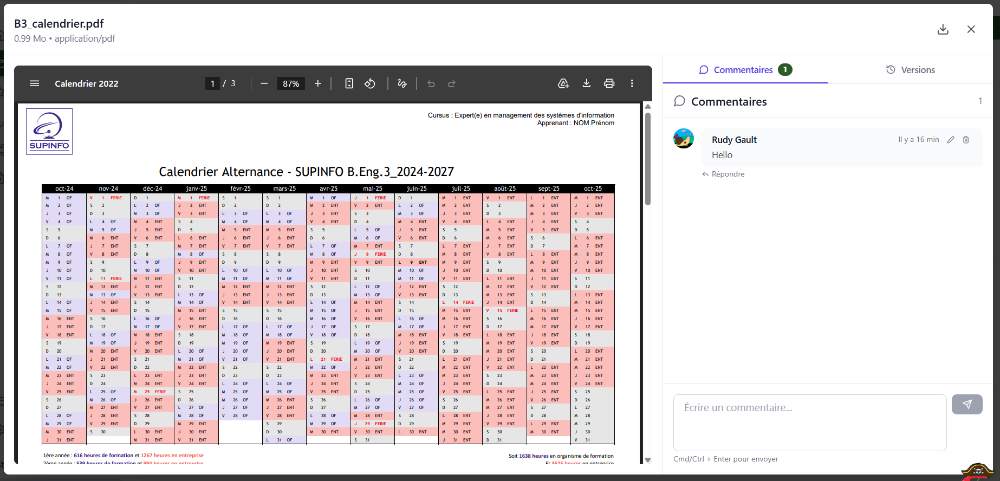
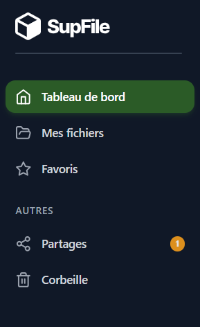

# 6. Partage et Collaboration

[< Retour au sommaire](README.md) | [< Gestion des Fichiers](05-gestion-fichiers.md)

---

## 6.1 Liens de partage public

Accessible depuis le menu contextuel → Partager → onglet **Lien public**.

### Generation
- Token UUID unique par fichier

### Options disponibles
| Option | Description |
|--------|-------------|
| Mot de passe | Protection optionnelle |
| Date d'expiration | Limite temporelle |
| Max telechargements | Quota de telechargements |

### Interface
- Bouton "Copier le lien"
- Liste des liens existants
- **Liens bundle** : plusieurs fichiers en un seul lien

| Web | Mobile |
|-----|--------|
|  |  |

*Interface de partage par lien public (Web et Mobile)*

---

## 6.2 Partage avec d'autres utilisateurs

### Web — onglet "Partager avec" dans ShareFileModal

### 4 permissions disponibles
| Permission | Description |
|------------|-------------|
| Lecture | Voir le fichier |
| Ecriture | Modifier le fichier |
| Suppression | Supprimer le fichier |
| Partage | Repartager avec d'autres |

### Fonctionnement
- Invitation → notification au destinataire
- Liste des partages actifs

| Permissions Web | Partage Mobile |
|-----------------|----------------|
|  |  |

*Gestion des permissions de partage (Web et Mobile)*

---

## 6.3 Partage de dossiers entre utilisateurs

### Page `/shared` — 3 onglets

| Onglet | Contenu |
|--------|---------|
| **En attente** | Invitations recues avec boutons Accepter (vert) / Refuser (rouge) |
| **Avec moi** | Dossiers/fichiers partages par d'autres + permissions |
| **Par moi** | Partages envoyes avec statut + boutons Modifier / Revoquer |

### PendingSharesModal
- Badge rouge sur la cloche
- Modale des invitations en attente

| Vue partagee 1 | Vue partagee 2 |
|----------------|----------------|
|  |  |

*Vues des fichiers partages (Web)*

### Mobile

| Liste des partages | Accepter un partage |
|--------------------|---------------------|
|  |  |

*Gestion des partages sur Mobile*

---

## 6.4 Gestion des permissions

### Composant PermissionsManager
4 toggles de permissions :
- Lecture
- Ecriture
- Suppression
- Repartage

Modification en temps reel.

---

## 6.5 Protection par mot de passe des partages

### Configuration
- Option a la creation du partage (lien ou direct)

### Acces
- `ShareUnlockModal` : champ mot de passe
- **5 tentatives max** avant blocage

---

## 6.6 Acces a un lien partage (vue invite)

**Chemin :** `/share/:token`

### Elements de l'interface
- Logo
- Nom du fichier
- Proprietaire
- Bouton Telecharger

### Cas particuliers
| Situation | Affichage |
|-----------|-----------|
| Protege | Champ mot de passe |
| Expire | Message d'erreur |
| Quota atteint | Message d'erreur |

| Invitation | Vue fichier partage |
|------------|---------------------|
|  |  |

*Invitation de partage et vue d'un fichier partage (Web)*

---

## 6.7 Commentaires sur les fichiers

### Web — CommentsPanel
- Panel lateral
- Avatar, prenom, date, texte
- Reponses imbriquees
- Champ "Ajouter un commentaire" + bouton Envoyer

### Mobile — CommentsPanel
- Bottom sheet ou section dans FilePreviewModal

| Web | Mobile |
|-----|--------|
|  |  |

*Commentaires sur les fichiers (Web et Mobile)*

---

## 6.8 Notifications de partage

### Web
- Cloche + badge rouge
- `NotificationCenter` : texte, date relative, marquer lu

### Types de notifications
| Type | Description |
|------|-------------|
| Partage recu | Nouveau partage de fichier/dossier |
| Nouveau commentaire | Commentaire sur un fichier partage |
| Alerte quota 90% | Espace de stockage presque plein |

### Mobile
- Notifications push Expo (voir section 16)

*Notification de partage dans le bandeau lateral (Web)*

---

## 6.9 Mode sombre

Le partage est egalement disponible en mode sombre :

*Interface de partage en mode sombre (Web)*

---

[Section suivante : Bobby - L'Assistant IA →](07-bobby-ia.md)
