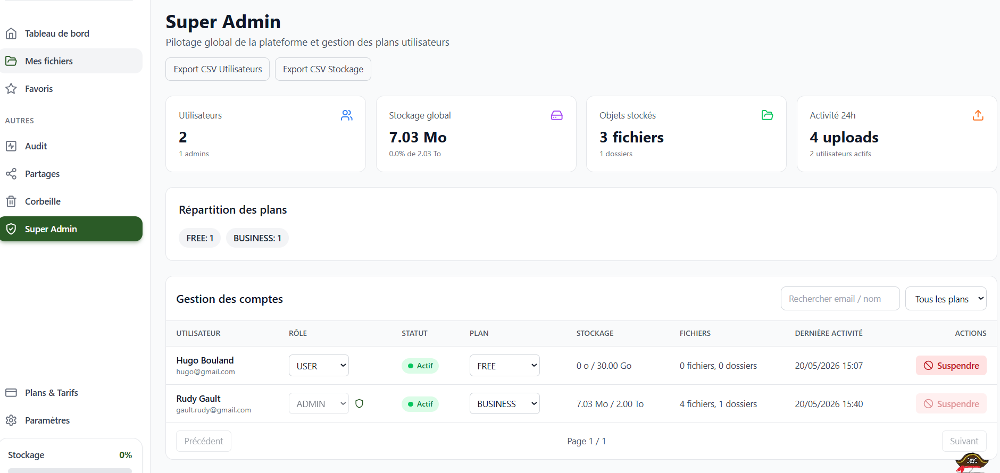

# 7. Bobby — L'Assistant IA

[< Retour au sommaire](README.md) | [< Partage](06-partage-collaboration.md)

---

> **Disponible pour :** plans PRO, BUSINESS et ENTERPRISE

Bobby est un assistant IA base sur une architecture **RAG 100% locale** via Ollama et ChromaDB. **Aucune donnee ne quitte le serveur.**

---

## 7.1 Interface de chat IA

### Web — `/ai`

#### Interface style messagerie
| Element | Position |
|---------|----------|
| Messages utilisateur | A droite (bleu) |
| Messages Bobby | A gauche |

#### Avatar Bobby
| Etat | Affichage |
|------|-----------|
| En attente | Animation idle |
| Reflexion | `working.gif` |

#### Fonctionnalites
- Historique des conversations
- Bouton "Nouvelle conversation"

| Bobby verrouille (FREE) | Bobby en conversation |
|-------------------------|----------------------|
|  |  |

*Interface Bobby sur Web : acces restreint et conversation active*

### Mobile — Onglet Bobby

- Meme interface adaptee au mobile
- **Si plan FREE** : affiche "Bobby est inclus a partir du plan PRO" + bouton "Voir les plans"

| Bobby verrouille (FREE) | Bobby en conversation |
|-------------------------|----------------------|
|  |  |

*Interface Bobby sur Mobile : acces restreint et conversation active*

---

## 7.2 Analyse de fichiers par IA

### Declenchement
- Depuis `FilePreviewModal` → "Analyser avec Bobby"
- OU depuis le chat Bobby directement

### Resultat
Bobby retourne :
- Resume du document
- Points cles
- Informations importantes

### Formats supportes
| Format | Support |
|--------|---------|
| PDF | Oui |
| Word | Oui |
| Excel | Oui |
| Fichiers texte | Oui |

---

## 7.3 Recherche semantique / IA

### Web
- Toggle "Recherche IA" sur la `SearchBar`
- Requete en langage naturel
- Resultats ChromaDB avec score de pertinence

### Mobile
- `SearchBar` avec mode semantique
- Resultats temps reel

---

## 7.4 Generation de fichiers par IA

### Utilisation
Depuis Bobby : "Genere un document sur [sujet]"

### Resultat
- Fichier cree automatiquement
- Sauvegarde directement dans les fichiers de l'utilisateur

---

## Architecture technique de Bobby

```
┌─────────────────┐
│   Interface     │
│   Chat Bobby    │
└────────┬────────┘
         │
         ▼
┌─────────────────┐
│   brain-api     │
│    (Python)     │
└────────┬────────┘
         │
    ┌────┴────┐
    │         │
    ▼         ▼
┌───────┐ ┌─────────┐
│Ollama │ │ChromaDB │
│ (LLM) │ │(Vectors)│
└───────┘ └─────────┘
```

### Points cles
- **100% local** : aucune donnee envoyee vers des API externes
- **RAG** (Retrieval-Augmented Generation) : recherche dans les documents de l'utilisateur
- **ChromaDB** : base vectorielle pour la recherche semantique
- **Ollama** : modele de langage local

---

[Section suivante : Coffre-Fort Securise →](08-coffre-fort.md)
