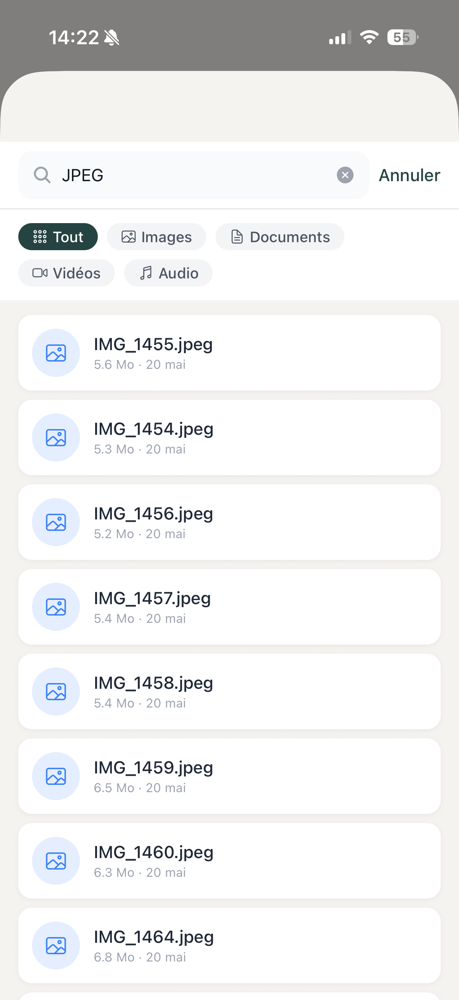

# 9. Recherche

[< Retour au sommaire](README.md) | [< Coffre-Fort](08-coffre-fort.md)

---

## 9.1 Web — SearchBar

### Modes de recherche

| Mode | Description | Disponibilite |
|------|-------------|---------------|
| **Par nom** | Suggestions temps reel des 2 caracteres | Tous les plans |
| **Full-text** | Dans le contenu des fichiers indexes | Tous les plans |
| **IA** | Requete langage naturel | PRO+ |

### Filtres disponibles

| Filtre | Description |
|--------|-------------|
| Type | Filtrer par type de fichier (image, document, video...) |
| Dossier parent | Limiter la recherche a un dossier |
| Plage de dates | Filtrer par date de creation/modification |
| Tags | Filtrer par tags attribues |

---

## 9.2 Mobile — SearchBar

### Interface
- Overlay plein ecran
- Resultats filtres en temps reel

### Fonctionnalites
- Memes modes de recherche que le Web
- Interface tactile optimisee
- Clavier avec suggestions

*Recherche sur Mobile avec resultats en temps reel*

---

## Comparatif des modes de recherche

| Critere | Par nom | Full-text | IA (PRO+) |
|---------|---------|-----------|-----------|
| Vitesse | Instantanee | Rapide | Variable |
| Precision | Exacte | Contenu | Semantique |
| Langage | Nom fichier | Mots-cles | Naturel |
| Exemple | "facture.pdf" | "montant TVA" | "trouve mes factures de janvier" |

---

[Section suivante : Parametres et Profil →](10-parametres.md)
