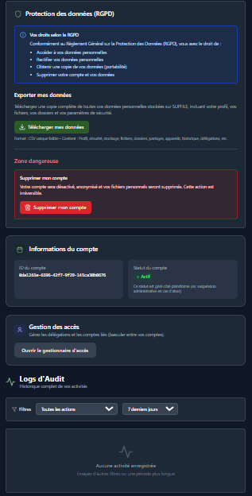
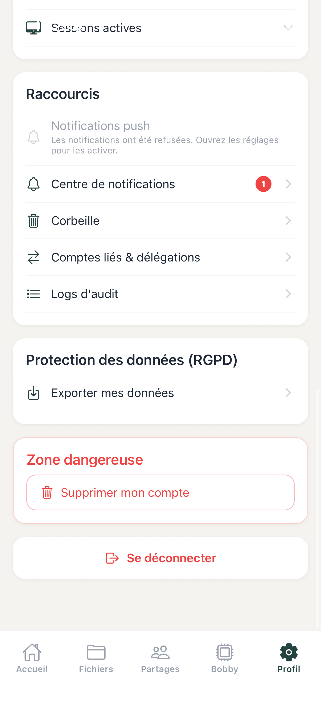

# 10. Parametres et Profil Utilisateur

[< Retour au sommaire](README.md) | [< Recherche](09-recherche.md)

---

## 10.1 Edition du profil — Web

### Informations modifiables
| Champ | Editable |
|-------|----------|
| Prenom | Oui |
| Nom | Oui |
| Email | Non (lecture seule) |

### Avatar
- Uploadable par clic → selecteur de fichiers

### Stockage
- Barre de progression visuelle
- Lien "Ameliorer le plan"

| Parametres Web 1 | Parametres Web 2 |
|------------------|------------------|
|  |  |

*Pages de parametres Web*

---

## 10.2 Changement de mot de passe

### Champs requis
1. Mot de passe actuel
2. Nouveau mot de passe
3. Confirmation du nouveau mot de passe
4. **Code MFA obligatoire**

---

## 10.3 Theme clair / sombre

### Web
- Toggle Soleil/Lune
- Changement instantane
- Persistant (localStorage + base de donnees)

### Mobile
- Toggle dans les parametres
- `useThemeStore` (Zustand)
- Options : Light / Dark / System

---

## 10.4 Configuration MFA — Web (MFASettingsSection)

### Si MFA active

| Element | Description |
|---------|-------------|
| Badge vert | "Actif" |
| Bouton | Desactiver MFA |
| Bouton | Regenerer les codes de secours |

### Si MFA desactive
- Bouton "Activer MFA" → QR code setup

### Appareils de confiance
- Liste des appareils
- Date derniere utilisation
- Bouton "Revoquer" pour chaque appareil

---

## 10.4b Configuration MFA — Mobile (SettingsScreen)

### Panneau MFA (Bottom sheet)
"Authentification a deux facteurs"

### Si MFA active
| Element | Description |
|---------|-------------|
| Badge | "MFA active" (coche) |
| Info | Codes restants |
| Liste | Appareils de confiance |

### Boutons disponibles
- Regenerer les codes de recuperation
- Desactiver le MFA (rouge)

| Settings Mobile 1 | Settings Mobile 2 | Settings Mobile 3 |
|-------------------|-------------------|-------------------|
|  |  |  |

*Pages de parametres Mobile avec MFA*

---

## 10.5 Coffre-fort dans les parametres

Voir [Section 8 - Coffre-Fort Securise](08-coffre-fort.md) pour les details complets.

---

## 10.6 Conformite RGPD — RGPDSection

### Export des donnees
- Bouton "Telecharger mes donnees"
- Format : ZIP contenant les metadonnees en JSON

### Suppression du compte
- Bouton rouge
- **Confirmation double** :
  1. Mot de passe
  2. Saisie du texte "SUPPRIMER"

---

## 10.7 Langue

### Web
- Selecteur Francais / English
- Changement instantane

### Mobile
- Selecteur dans parametres
- `useI18nStore` pour la gestion

---

[Section suivante : Abonnements et Plans →](11-abonnements.md)
