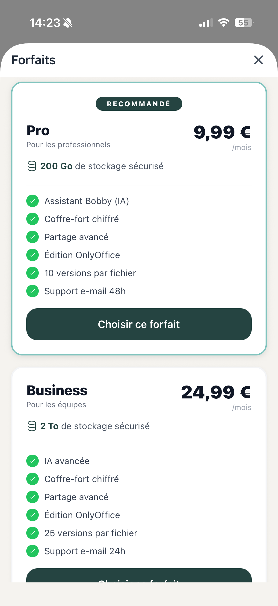

# 11. Abonnements et Plans

[< Retour au sommaire](README.md) | [< Parametres](10-parametres.md)

---

## 11.1 Web — `/plans`

### Presentation
4 cards cote a cote : FREE / PRO / BUSINESS / ENTERPRISE

### Contenu de chaque card
- Nom du plan
- Prix
- Badge "Plan actuel" (si applicable)
- Liste des fonctionnalites avec icones
- Bouton d'action Stripe


*Page des plans et abonnements (Web)*

---

## Comparatif des plans

| Plan | Stockage | Bobby IA | Audit | Coffre | Organisations |
|------|----------|----------|-------|--------|---------------|
| **FREE** | 30 Go | Non | Non | Non | Non |
| **PRO** | Augmente | Oui | Oui | Oui | Non |
| **BUSINESS** | Augmente | Oui | Oui | Oui | Oui |
| **ENTERPRISE** | Sur mesure | Oui | Oui | Oui | Oui |

---

## Integration Stripe

| Action | Interface |
|--------|-----------|
| S'abonner | Stripe Checkout |
| Gerer l'abonnement | Stripe Portal |

### Flux d'abonnement

```
┌─────────────────┐
│   Page /plans   │
│  (choix du plan)│
└────────┬────────┘
         │ Clic "S'abonner"
         ▼
┌─────────────────┐
│ Stripe Checkout │
│   (paiement)    │
└────────┬────────┘
         │ Paiement reussi
         ▼
┌─────────────────┐
│  Plan active    │
│ (fonctionnalites│
│   deverrouillees)│
└─────────────────┘
```

---

## 11.2 Mobile — PlansModal

### Interface
- Modal plein ecran ou bottom sheet
- Meme presentation que le Web
- Redirection vers Stripe pour le paiement



*Page des plans sur Mobile*

---

## Details des fonctionnalites par plan

### FREE (30 Go)
- Upload et download de fichiers
- Partage par lien public
- Partage basique avec utilisateurs
- Favoris et tags
- Corbeille

### PRO (Stockage augmente)
Tout le FREE +
- **Bobby IA** : assistant intelligent
- **Journal d'audit** : tracabilite des actions
- **Coffre-fort** : double chiffrement
- **Versioning avance** : historique des fichiers
- Protection par mot de passe des partages

### BUSINESS (Stockage augmente)
Tout le PRO +
- **Organisations** : gestion multi-utilisateurs
- **Partage avance** : entre membres d'organisation
- Roles et permissions granulaires

### ENTERPRISE (Sur mesure)
Tout le BUSINESS +
- Fonctionnalites sur mesure
- Deploiement dedie
- Support prioritaire
- SLA personnalise

---

[Section suivante : Organisations →](12-organisations.md)
