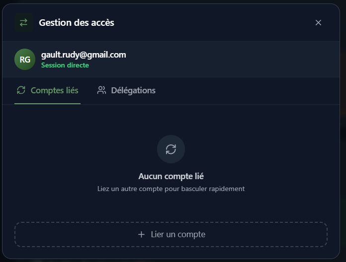

# 14. Delegation et Changement de Compte

[< Retour au sommaire](README.md) | [< Audit](13-audit.md)

---

## 14.1 Delegation

### Principe
Permet a un utilisateur **A** de donner des permissions a **B** pour acceder a ses fichiers **sans partager son mot de passe**.

### Creation d'une delegation

1. Selectionner l'utilisateur destinataire
2. Configurer les **4 permissions granulaires** :
   - Lecture
   - Ecriture
   - Suppression
   - Repartage

### Utilisation de la delegation

L'utilisateur **B** voit l'option "Acceder aux fichiers de [A]"
→ Ouverture d'une **sous-session** avec les permissions accordees

---

## Flux de delegation

```
┌─────────────────┐
│  Utilisateur A  │
│  (proprietaire) │
└────────┬────────┘
         │ Cree delegation
         │ (4 permissions)
         ▼
┌─────────────────┐
│  Utilisateur B  │
│  (delegataire)  │
└────────┬────────┘
         │ "Acceder aux fichiers de A"
         ▼
┌─────────────────┐
│  Sous-session   │
│ (vue fichiers A │
│  avec droits    │
│  limites)       │
└─────────────────┘
```

---

## 14.2 Changement de Compte (AccountSwitcherModal)

### Acces
Accessible depuis l'avatar en bas de la sidebar

### Interface
- Liste des comptes lies
- Bouton "Ajouter un compte" (lien de switch)

### Fonctionnement
1. Clic sur un compte lie
2. Switch → sous-session
3. Bouton "Retour au compte principal" disponible



*Modale de changement de compte avec comptes lies*

---

## Comparaison : Delegation vs Partage

| Critere | Delegation | Partage |
|---------|------------|---------|
| Portee | Tous les fichiers | Fichier/dossier specifique |
| Duree | Permanente (revocable) | Selon configuration |
| Interface | Sous-session complete | Acces direct au fichier |
| Permissions | 4 niveaux granulaires | 4 niveaux granulaires |

---

## Securite de la delegation

### Points cles
- **Pas de partage de mot de passe** : l'utilisateur B n'a jamais acces aux credentials de A
- **Revocable a tout moment** : A peut retirer la delegation instantanement
- **Tracabilite** : toutes les actions de B sont loguees dans l'audit de A
- **Permissions limitees** : B ne peut faire que ce qui est explicitement autorise

---

[Section suivante : Administration →](15-administration.md)
