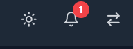
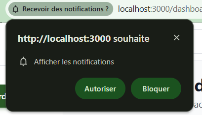

# 16. Notifications

[< Retour au sommaire](README.md) | [< Administration](15-administration.md)

---

## 16.1 Centre de Notifications — Web

### Acces
- Icone cloche dans le header
- Badge rouge indiquant le nombre de notifications non lues

### Contenu d'une notification

| Element | Description |
|---------|-------------|
| Icone | Typee selon le type de notification |
| Texte | Description de l'evenement |
| Date | Date relative (il y a 5 min, hier...) |
| Action | Bouton "Marquer comme lu" |

### Actions globales
- **Tout marquer comme lu**
- **Clic sur une notification** → navigation vers l'element concerne

| Icone | Centre de notifications |
|-------|-------------------------|
|  |  |

*Icone de notification et centre de notifications (Web)*

---

## 16.2 Push Notifications — Mobile (Expo Push)

### Activation
- Permission demandee a la premiere utilisation (iOS/Android)

### Types de notifications push

| Type | Declencheur |
|------|-------------|
| Nouveau partage | Un utilisateur partage un fichier/dossier |
| Commentaire | Nouveau commentaire sur un fichier |
| Alerte quota 90% | Stockage presque plein |
| Alerte quota 100% | Stockage plein |

### Deep linking
- Clic sur la notification → ouverture directe de l'ecran concerne (via Expo deep link)

---

## 16.3 Web Push (navigateur)

### Activation
- Opt-in propose apres connexion
- Permission navigateur requise

### Fonctionnement
- Notifications systeme en arriere-plan
- Meme si l'onglet SUPFile est ferme

*Demande de permission pour les notifications*

---

## Types de notifications

| Type | Description | Canal |
|------|-------------|-------|
| **Partage recu** | Quelqu'un a partage un fichier avec vous | Web, Push |
| **Nouveau commentaire** | Commentaire sur un fichier partage | Web, Push |
| **Quota 90%** | Espace de stockage presque plein | Web, Push |
| **Quota 100%** | Espace de stockage plein | Web, Push |
| **Invitation organisation** | Invitation a rejoindre une organisation | Web, Push |
| **Modification partage** | Permissions modifiees sur un partage | Web |

---

## Configuration des notifications

### Preferences utilisateur
- Activer/desactiver par type
- Choix du canal (Web, Push, Email)

### Bonnes pratiques
- Activer les alertes de quota pour eviter les blocages
- Activer les notifications de partage pour ne rien manquer

---

[Section suivante : Annexes →](17-annexes.md)
